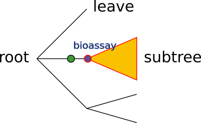
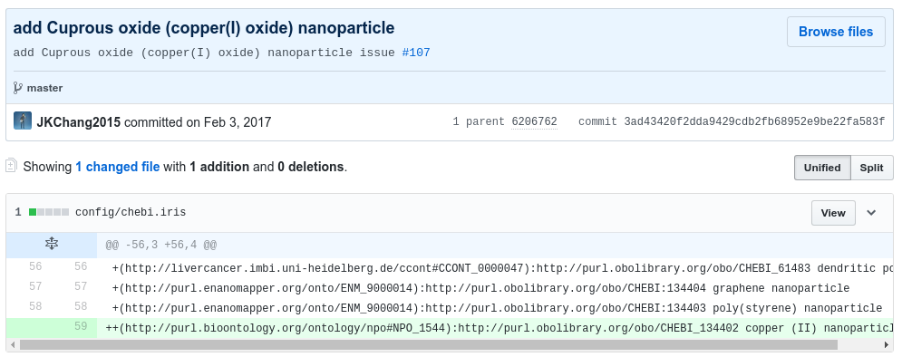
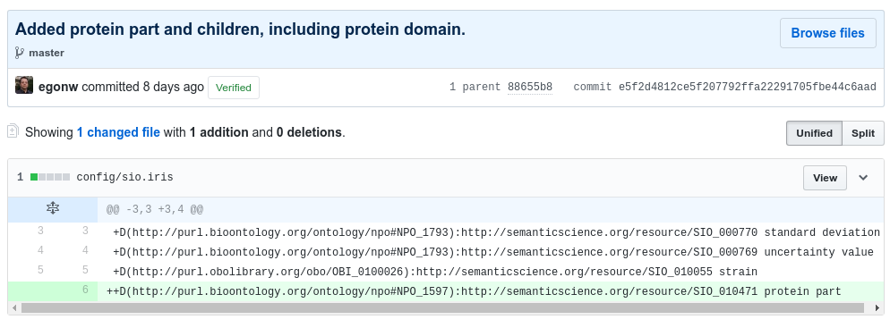
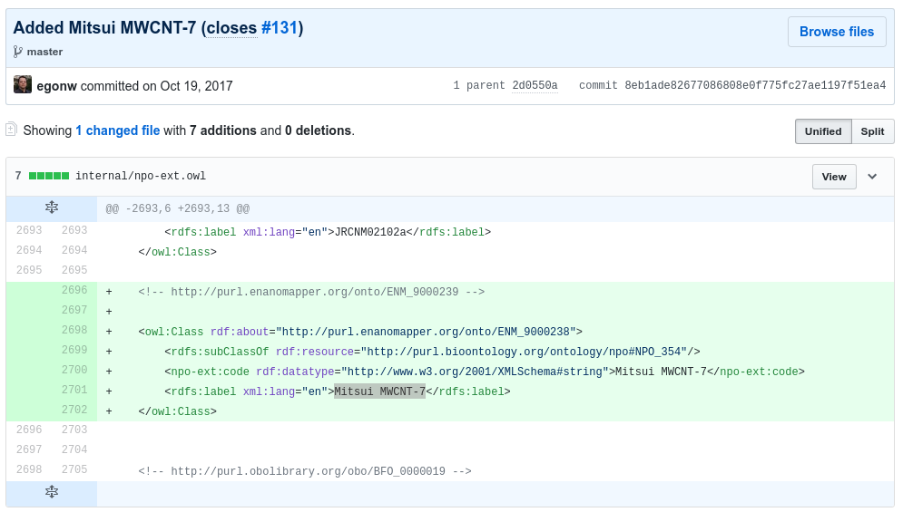
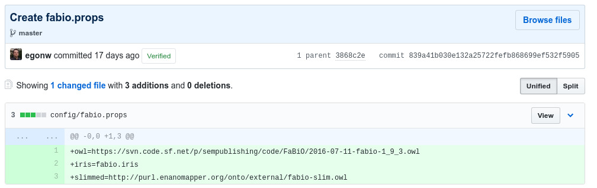
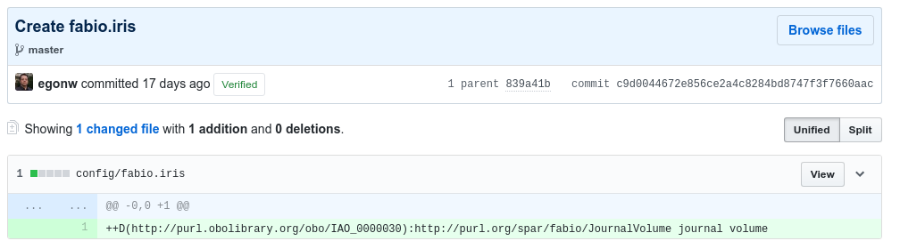

# Adding ontology terms

* Author: Egon Willighagen (orcid:[0000-0001-7542-0286](https://orcid.org/0000-0001-7542-0286))
* License: [CC-BY 4.0](https://creativecommons.org/licenses/by/4.0/)
* Version: 1.0.3
* Source: [https://github.com/enanomapper/tutorials/tree/master/Added%20ontology%20terms](https://github.com/enanomapper/tutorials/tree/master/Added%20ontology%20terms)

This tutorial describes how terms can be added to the eNanoMapper ontology.
Before walking through this tutorial, it is recommended to read the following
documents:

* Article: [eNanoMapper: harnessing ontologies to enable data integration for nanomaterial risk assessment](https://jbiomedsem.biomedcentral.com/articles/10.1186/s13326-015-0005-5)
* Deliverable Report D2.1 [Framework and Infrastructure for Ontology development, versioning and dissemination](http://doi.org/10.5281/zenodo.375633)
* Deliverable Report D2.2 [Ontology Content Types and Existing Community efforts](http://doi.org/10.5281/zenodo.375634)
* Deliverable Report D2.3 [Ontology initial release](http://doi.org/10.5281/zenodo.375635)
* Deliverable Report D2.4 [Ontology final release](http://doi.org/10.5281/zenodo.375633)

# A collection on ontology parts

The eNanoMapper ontology is mostly composed of other ontologies, with extensions here and there.
The full list of ontologies it includes is:

* [Adverse Outcome Pathways Ontology](https://github.com/DataSciBurgoon/aop-ontology) (AOP)
* [BioAssay Ontology](http://bioassayontology.org/) (BAO)
* [Basic Formal Ontology](http://basic-formal-ontology.org/) (BFO)
* [Cell Culture Ontology](http://bioportal.bioontology.org/ontologies/CCONT?p=summary) (CCONT)
* [Chemical Entities of Biological Interest](https://www.ebi.ac.uk/chebi/) (CHEBI)
* [Chemical Information Ontology](https://github.com/semanticchemistry/semanticchemistry/) (CHEMINF)
* [Chemical Methods Ontology](https://github.com/rsc-ontologies/rsc-cmo) (CHMO)
* [Experimental Factor Ontology](https://www.ebi.ac.uk/efo/) (EFO)
* [Environment Ontology](http://environmentontology.org/) (ENVO)
* [FRBR-aligned Bibliographic Ontology](https://sparontologies.github.io/fabio/current/fabio.html) (FABIO)
* [Gene Ontology](http://www.geneontology.org/) (GO)
* [Human Physiology Simulation Ontology](https://www.scai.fraunhofer.de/en/business-research-areas/bioinformatics/downloads.html) (HUPSON)
* [Information Artifact Ontology](https://github.com/information-artifact-ontology/IAO/) (IAO)
* [National Cancer Institute Thesaurus](https://nciterms.nci.nih.gov/) (NCIT)
* [NanoParticle Ontology](http://www.nano-ontology.org/) (NPO)
* [Ontology of Adverse Events](http://www.oae-ontology.org/) (OAE)
* [Ontology of Biological and Clinical Statistics](https://github.com/obcs/obcs) (OBCS)
* [Ontology for Biomedical Investigations](http://obi-ontology.org/) (OBI)
* [Phenotype And Trait Ontology](https://github.com/pato-ontology/pato) (PATO)
* [Semanticscience Integrated Ontology](https://github.com/micheldumontier/semanticscience) (SIO)
* [Unit Ontology](https://github.com/bio-ontology-research-group/unit-ontology) (UO)

However, the eNanoMapper ontology does not use full ontologies, and there are
reasons why that is essential:

* Most ontologies include bits from other ontologies; and,
* Some ontologies do not just have core concepts, but enumerate hundreds or thousands of instances.

The first reason has to do with maintainability. For example, what happens if two ontologies we import
both import a third ontology, which import do we then take? eNanoMapper has chosen to always take the upstream
version of the ontology. Besides resolving multiple imports of that third ontology, we now also have
more control over which version we use. The situation is comparible to dependency resolution in software
development.

The second reason has to do with controlling the FAIR-ness of the eNanoMapper ontology. For example, we
want to ensure that terms important to the nanosafety field are not too hard to find. Therefore, the size
of the ontology matters.

For these reasons, we select parts of ontologies (a full description of the design decision can be found
in the eNanoMapper ontology publication). In order to perform this slicing we need a tool that can do this
slicing and we need to instruct this slices which bits to keep.

# The configuration file

Configuration file are used to define which parts of which ontologies are used. These configuration files
can be [found on GitHub](https://github.com/enanomapper/ontologies/tree/master/config). For each of the ontologies,
two files are provided:

1. A .props file
2. A .iris file

## The *props* file

The first "props" file is the one initially read by the [Slimmer tool](https://github.com/enanomapper/slimmer) and looks like:

```
owl=https://raw.githubusercontent.com/enanomapper/aop-ontology/patch/hpoUpdate/aopo.owl
iris=aopo.iris
slimmed=http://purl.enanomapper.org/onto/external/aopo-slim.owl
```

It has three fields as explained in the following subsections

### Source ontology file

The `owl=` line indicates where the OWL file of the ontology to be slimmed can be downloaded (this is normally an
upstream location, but a cached version in this particular case). It is exactly this OWL file that is loaded by the OWLAPI-based Slimmer utility, and slimmed.

### Specifying the configuration

The `iris=` line indicates the configuration file is found locally which defines which IRIs are to be included and excluded in the slimmed version of the ontology. The syntax of the `.iris` file is discussed below.

### The slimmed ontology file

The `slimmed=` line specifies the file name under which the resulting slimmed ontology is saved. It is this
file that is to be imported by the main eNanoMapper OWL file. That is, this URL is used for
*owl:import* statements in the eNanoMapper ontology, which is the used mechanism to include slimmed
ontology modules.

## The *iris* file

The second configuration file defined the input to the slimming process and specifies what parts are meant
to be kept. The format is a custom format specifically developed for our slimming needs.

The `.iris` file configures the slicing of the ontology. It specifies which classes or class tress to include and which parts to exclude. For each included class it can also specify a new classes it subclasses. Each line in this file defines one instruction: one addition or one removal.

For example:
```
+D(http://purl.bioontology.org/ontology/npo#NPO_1436):http://www.bioassayontology.org/bao#BAO_0000697 detection instrument
+D(http://purl.obolibrary.org/obo/IAO_0000030):http://www.bioassayontology.org/bao#BAO_0000179 endpoint
+D(http://purl.obolibrary.org/obo/OBI_0000070):http://www.bioassayontology.org/bao#BAO_0000015 bioassay
````

This configuration file uses a custom syntax which is briefly explained here.
Here, the first line in the above example shows that the term detection instrument is imported (from the BAO ontology) and made a subclass of the NPO_1436 class from the NPO ontology.

### The Syntax

Each instruction has the same structure, the same syntax, organized in layers:


We can see here basically the five layers (red, yellow, green, purple, and blue) and in semi-colon (light blue) to
separate two layers. If you consider that an ontology is often a hierarchical tree
of terms, with one root node, spreading down, ending in leaf nodes, the above instruction could be visualized as
this:



A more detailed description of each layer is introduced below.

### Adding and removing (red layer)

By default it removes all content. The first character indicates if the something needs to be
included (+) or excluded from a previously defined inclusion (-).
 
### Selections up and down (yellow layer)

The second layer indicates with a single character (U or D) whether a whole upper (U) or down (D) tree should be included
or excluded (as defined by the first layer). This layer is optional and if not given then a single term is added.
Second, the U operation is not currently used by eNanoMapper.

An example of a command without the U or D operator that adds a single term:

```
+(http://www.bioassayontology.org/bao#BAO_0003009):http://purl.bioontology.org/ontology/npo#NPO_1709 LDH assay
```

This example reorganizes an existing term of the NPO into a location under a BAO term.

### Which term to include (purple layer) and a label or reason (blue layer)

After the colon the URI of the resource is given to be in- or excluded,
followed by a user-oriented comment. This comment can be the label of the item,
a general comment, or the reason for adding it. It is not used in the slimming
process.

### Where to add it in the eNanoMapper ontology (green layer)

Finally, before the colon and in brackets an optional superclass of this resource can be specified,
possibly from other ontologies. The instruction indicating where in an ontology a term is to be added
is used a lot. As the comment in this instruction shows, it can be used to move terms in different
places in the ontology. For example, we can move a nanoparticle term from the ChEBI ontology to
a place in a selected (slimmed) subtree of the NPO:

```
+(http://purl.bioontology.org/ontology/npo#NPO_1384):http://purl.obolibrary.org/obo/CHEBI_50831      relocate platinum nanoparticle
```

# Adding terms

Adding terms to the eNanoMapper ontology is basically equivalent to making changes or adding such configuration files.
If the ontology already exists, then you basically change the content of the *iris* file. If you need a new ontology
from which you want to include terms, then you need to create a new combination of a *props* and an *iris* file. This
is explained in the next sections.

## Adding a term from an already used ontology

When you identified the term you want to add in an ontology that already is used by the eNanoMapper
ontology (see [this list](README.html#a-collection-on-ontology-parts)), you basically need to identify
the following information:

1. What is the IRI of the term?
2. Is it just that single term, or also parent or child terms?
3. Where in the eNanoMapper ontology should your selection show up?

That last question should be carefully considered, taking the hierarchy of the ontology into account.
For example, moving a term below some concept from the BFO under a different concept from the BFO
only works out well if one of the BFO concepts is a subclass of the other.

### An example of adding a single term

The simplest addition one can make to the ontology, is adding a single term. One basically then only
needs to know which term to add, and the parent of the term in the eNanoMapper ontology. We then do
not have to worry about pulling in a full subtree, which may introduce a large set of terms and bloat
the ontology.

The following screenshot shows a
[commit](https://github.com/enanomapper/ontologies/commit/3ad43420f2dda9429cdb2fb68952e9be22fa583f)
that adds a terms (*cuprous oxide nanoparticle*) from an ontology that already is used (CHEBI)
and puts it in as a child of term another already used ontology (NPO):




### An example of adding a term and all children

The following screenshot shows a
[commit](https://github.com/enanomapper/ontologies/commit/e5f2d4812ce5f207792ffa22291705fbe44c6aad)
that adds a term (*protein part*) from an ontology that already is used (SIO):



### An example of a new term, unavailable from any ontology

The last example given here is adding a term that does not exist in any ontology. In this situation
we can just create a new term. The hardest part is to select a new term identifier (IRI) for the term
that is not used already.

New terms are defined as Web Ontology Language (OWL) classes, and should have an identifier (already said),
label, and superclass. It may look like (actual example, see commit below):

For example:

```xml
<owl:Class rdf:about="http://purl.enanomapper.org/onto/ENM_9000238">
  <rdfs:subClassOf rdf:resource="http://purl.bioontology.org/ontology/npo#NPO_354"/>
  <rdfs:label xml:lang="en">Mitsui MWCNT-7</rdfs:label>
</owl>
```

The above example adds a term with the IRI `http://purl.enanomapper.org/onto/ENM_9000238`. The local part
`ENM_9000238` must be unique. When creating a new IRI, it is important to ensure it is.

Some people may prefer adding this term with [Protégé](https://protege.stanford.edu/) (which has the advantage
that it will figure out an unused identifier) but it can be just as well added with a plain text editor.
Ideally, the editor understands XML Schema, allowing you to be warned of the XML/OWL syntax is not correct, e.g.
the [Kate editor](https://kate-editor.org/).

These additions are put in files in the [internal folder](https://github.com/enanomapper/ontologies/tree/master/internal).
Several ontologies already have terms that should, ultimately, be incorporated in that upstream ontology.

The following screenshot shows an example existing
[commit](https://github.com/enanomapper/ontologies/commit/8eb1ade82677086808e0f775fc27ae1197f51ea4)
that adds a term (*Mitsui MWCNT-7*) as child to a term from an ontology that already is used (NPO):



## Adding a term from an ontology that is not yet used

Adding a term from an ontology that is not yet used is not that different from the adding the terms
from an already used ontology: we just have to make sure that the ontology is "used". That means,
we have to ensure the following:

1. Create a .props and .iris file (as described earlier)
2. Set up a Jenkins job for the slimming
3. Include the new ontology in the eNanoMapper ontology

The first step is to create the .props and .iris file. The latter can even be empty at the start, or
contain a single term to be added. The combination of the following
[two](https://github.com/enanomapper/ontologies/commit/839a41b030e132a25722fefb868699ef532f5905)
[commits](https://github.com/enanomapper/ontologies/commit/c9d0044672e856ce2a4c8284bd8747f3f7660aac)
show how the FABIO ontology was recently added:



and



Setting up Jenkins can be done by everyone from the eNanoMapper project, but the reader
can also [file an issue here](https://github.com/enanomapper/ontologies/issues) to request adding
an ontology, or do that as part of the pull request that adds the above two files. In fact,
do not worry too much about this step, as this is a responsibility of the ontology release
manager (currently Egon Willighagen).

The final step is to ensure the ontology is listed (`owl:include`) in the ontology, which is
done by adding a line to the
[enanomapper-auto-dev.owl](https://github.com/enanomapper/ontologies/blob/master/enanomapper-auto-dev.owl)
file, which looks like:

```xml
<owl:imports rdf:resource="http://purl.enanomapper.net/onto-dev/AOP/ws/aopo-slim.owl"/>
```

# Monitoring the building

The building of the eNanoMapper ontology is monitored by a Jenkins server hosted by the BiGCaT group,
part of the NUTRIM research school at [Maastricht University](https://www.maastrichtuniversity.nl/).
Login access to this server is set up by
In Silico Toxicology Gmbh and uses the OpenTox Authentication and Authorisation framework. This
section gives some pointers how this build server allows you to monitor

## Checking the building

[Jenkins](https://jenkins.io/) is a continuous build server, hosted at
[https://jenm.bigcat.maastrichtuniversity.nl/](https://jenm.bigcat.maastrichtuniversity.nl/).
Here, jobs run for each of the included ontologies:

* [AOP](https://jenm.bigcat.maastrichtuniversity.nl/job/AOP/)
* [BAO](https://jenm.bigcat.maastrichtuniversity.nl/job/BAO/)
* [BFO](https://jenm.bigcat.maastrichtuniversity.nl/job/BFO/)
* [CCONT](https://jenm.bigcat.maastrichtuniversity.nl/job/CCONT/)
* [CHEBI](https://jenm.bigcat.maastrichtuniversity.nl/job/CHEBI/)
* [CHEMINF](https://jenm.bigcat.maastrichtuniversity.nl/job/CHEMINF/)
* [CHMO](https://jenm.bigcat.maastrichtuniversity.nl/job/CHMO/)
* [EFO](https://jenm.bigcat.maastrichtuniversity.nl/job/EFO/)
* [ENVO](https://jenm.bigcat.maastrichtuniversity.nl/job/ENVO/)
* [FABIO](https://jenm.bigcat.maastrichtuniversity.nl/job/FABIO/)
* [GO](https://jenm.bigcat.maastrichtuniversity.nl/job/GO/)
* [HUPSON](https://jenm.bigcat.maastrichtuniversity.nl/job/HUPSON/)
* [IAO](https://jenm.bigcat.maastrichtuniversity.nl/job/IAO/)
* [NCIT](https://jenm.bigcat.maastrichtuniversity.nl/job/NCIT/)
* [NPO](https://jenm.bigcat.maastrichtuniversity.nl/job/NPO/)
* [OAE](https://jenm.bigcat.maastrichtuniversity.nl/job/OAE/)
* [OBCS](https://jenm.bigcat.maastrichtuniversity.nl/job/OBCS/)
* [OBI](https://jenm.bigcat.maastrichtuniversity.nl/job/OBI/)
* [PATO](https://jenm.bigcat.maastrichtuniversity.nl/job/PATO/)
* [SIO](https://jenm.bigcat.maastrichtuniversity.nl/job/SIO/)
* [UO](https://jenm.bigcat.maastrichtuniversity.nl/job/UO/)

## Checking the outcome

The final check to be performed is to see if the term actually shows up on the ontology browsers (BioPortal,
Ontology Lookup Service, AberOWL, etc). For that, please check
[Browsing the eNM ontology with BioPortal, AberOWL and Protégé](BrowseOntology/Tutorial%20browsing%20eNM%20ontology.html) tutorial.

## How a Slimming job is set up

As indicated earlier, each of the ontologies is slimmed by a separate Jenkins job. Basically, for each of the ontologies
the following steps are taken, here for the AOP ontology. The first step is to delete old files and
download the OWL file of the ontology (which it really should get from the .props file, but
currently still is hard coded):

```shell
rm -f *.owl
rm -f *.owl.*
wget -O aopo.owl https://raw.githubusercontent.com/enanomapper/aop-ontology/patch/hpoUpdate/aopo.owl
```

The next step makes sure to get the latest copies from the ontologies repository of the .prop and .iris files,
followed by calling the Slimmer tool, which automatically detects the .props file in the current (`.`)
directory:

```shell
rm -f aopo.props*
rm -f aopo.iris*
wget https://raw.githubusercontent.com/enanomapper/ontologies/master/config/aopo.props
wget https://raw.githubusercontent.com/enanomapper/ontologies/master/config/aopo.iris
java -cp ../Slimmer/target/slimmer-0.0.1-SNAPSHOT-jar-with-dependencies.jar com.github.enanomapper.Slimmer .
```

# Acknowledgments

This tutorial was written as part of the OpenRiskNet and NanoCommons projects.
[OpenRiskNet](https://openrisknet.org/) (Grant Agreement
[731075](http://cordis.europa.eu/projects/731075)) and
[NanoCommons](https://www.nanocommons.eu/) (Grant Agreement 
[731032](http://cordis.europa.eu/projects/731032)) are projects
funded by the European Commission within Horizon2020 Programme


