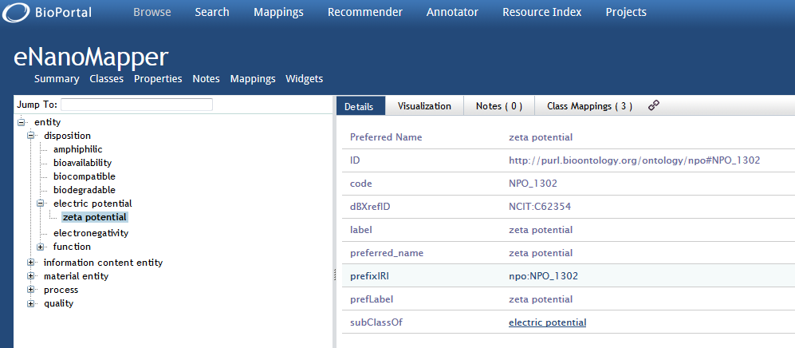
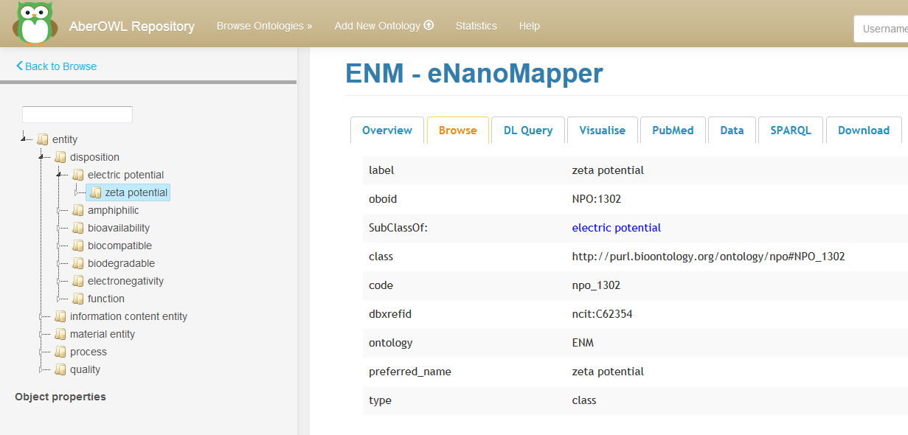
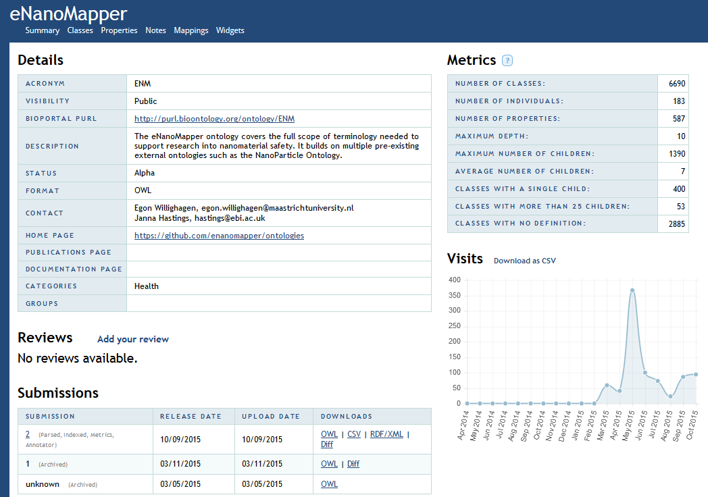
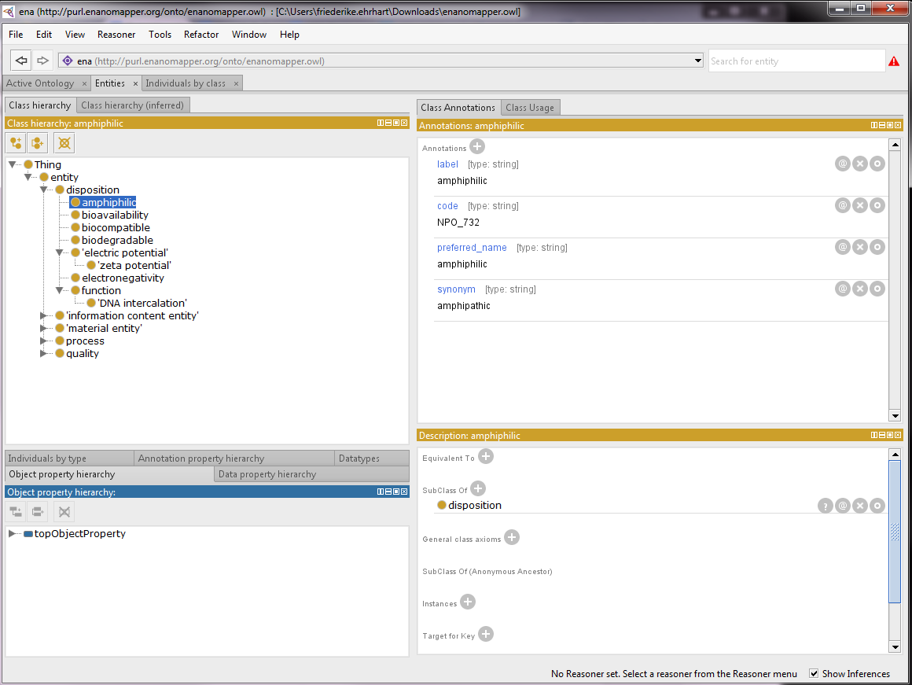
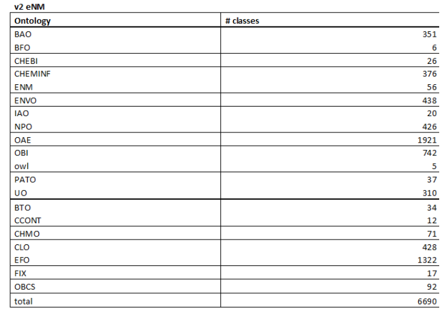
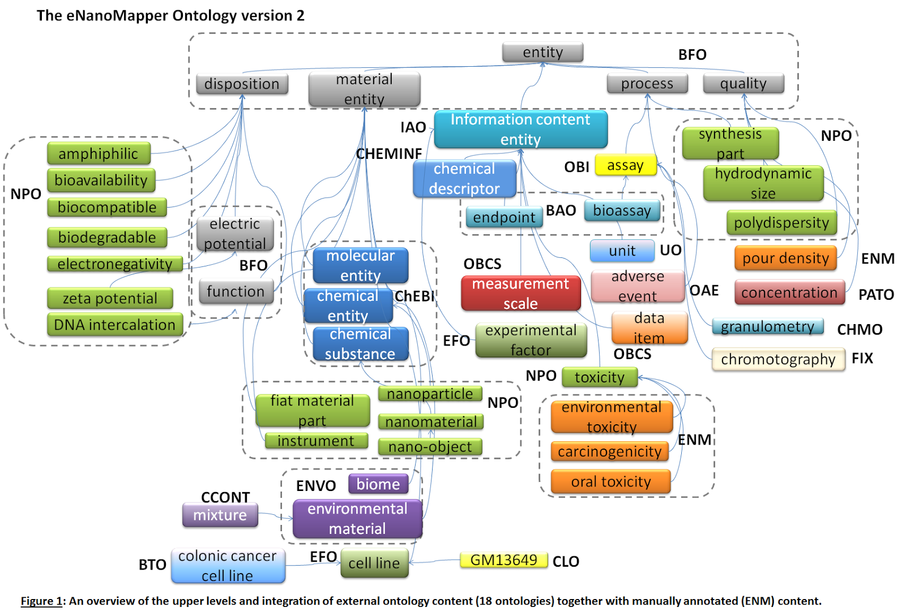
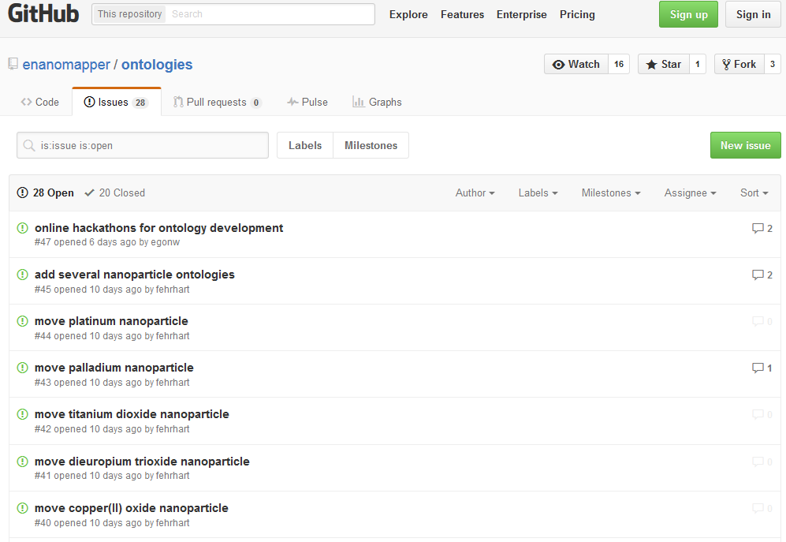
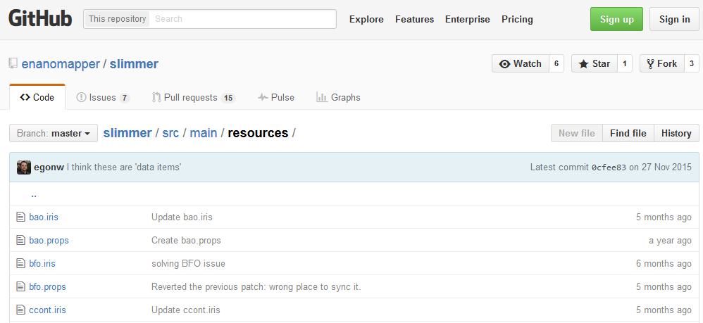

# Browsing the eNanoMapper ontology with BioPortal, AberOWL and Protégé

* Release: 2018-05-08
* Version: v1.1.1
* Main Author: Linda Rieswijk (ORCID:[0000-0002-6106-1347](https://orcid.org/0000-0002-6106-1347))
* Authors: Linda Rieswijk, Friederike Ehrhart (ORCID:[0000-0002-7770-620X](https://orcid.org/0000-0002-7770-620X)), and Egon Willighagen (ORCID:[0000-0001-7542-0286](https://orcid.org/0000-0001-7542-0286))
* License: [Creative Commons Attribution (CC-BY) 4.0](https://creativecommons.org/licenses/by/4.0/)

Introduction
------------

The field of engineered nanomaterials is exponentially growing as well as the demand to assure the
safe use of this type of materials. Nanomaterials are defined as being materials with at least one
external dimension in the size range from approximately 1-100 nm. Nanoparticles are objects with
all three external dimensions at the nanoscale. Engineered nanomaterials can be used within a
numerous amount of application such as:

1. In the design of pharmaceuticals specifically targeting organs or cells in the body such as cancer cells which also enhances the effectiveness of therapies.
1. To make materials such as cloth or cement stronger and lighter.
1. Use in electronics, as environmental remediation or clean-up to bind with and neutralize toxins, for their anti-bacterial function in cosmetics etc.  

The primary objective of WP2 within the FP7 EU-funded eNanoMapper (eNM) project is to develop and
disseminate a comprehensive ontology for the nanosafety domain, encompassing nanomaterials and all
information relating to their characterization, as well as information describing relevant
experimental paradigms, biological interactions, safety indications and experimental paradigms.

The current version of the eNanoMapper ontology
[[1](http://dx.doi.org/10.1186/s13326-015-0005-5),[2](http://bioportal.bioontology.org/ontologies/ENM),[3](http://aber-owl.net/ontology/enm)]
is based on the re-usage of 18 existing ontologies
(e.g. NanoParticle Ontology, BioAssay Ontology, Experimental Factor Ontology) together with
specialized engineered nanomaterials and nanotechnology vocabularies and definitions, which have
been described by several national and international standardization committees (e.g.
International Organization for Standardization, Joint Research Centre).

The re-used ontologies (OWL file) were made [slimmer](https://github.com/enanomapper/slimmer),
if necessary modified using the free,
open-source ontology editor [Protégé](http://protege.stanford.edu/) and new terms were
added using the [issue tracker](https://github.com/enanomapper/ontologies/issues) within GitHub.

The eNM ontology might be accessed through three different ways, namely online via
[BioPortal](http://www.ncbi.nlm.nih.gov/pmc/articles/PMC3125807/) and
[AberOWL](http://link.springer.com/article/10.1186%2Fs12859-015-0456-9)
 or locally using the open-source Protégé software. This tutorial focusses on browsing
through the eNM ontology when one would be interested in finding a Unique Resource Identifier (URI)
for mapping a term originating from for example a database schema. Using URIs for database schemas
will facilitate the harmonization of data originating from different sources and will make them
more comparable. 

In order to generate an ontology for engineered nanomaterials which is covering all domains also
instructions are provided within this tutorial on which steps should be taken when a term is not
present within the eNM ontology. 

Tutorial for usage of the eNanoMapper Ontology for mapping terms
----------------------------------------------------------------

There are three options for searching URIs for terms originating from for example a database
schema within the eNM ontology.

### eNM ontology with BioPortal

* Go to the ENM ontology within BioPortal.
  * [http://bioportal.bioontology.org/ontologies/ENM](http://bioportal.bioontology.org/ontologies/ENM)
* If you click on “classes” you will find the hierarchical ontological tree.
* By clicking on “entity” all the sub- and head classes will be provided.
* In the box of “Jump To:” a particular term might be searched within the ontology.
* In this example we are interested in “zeta potential”.
* Suggestions for possible URIs will be given which are present within the eNM ontology.
* Click on the term you are interested in (in this case “zeta potential”).
* Details will be provided on the term and the position of the term in the hierarchical ontological tree will be visualized (see Figure 1).

Figure 1: Browsing the eNM ontology within BioPortal.

### eNM ontology in AberOWL

* Go to the ENM ontology within AberOWL.
  * [http://aber-owl.net/ontology/ENM/](http://aber-owl.net/ontology/ENM/)
* On the left you will find an interactive view of the hierarchical ontological tree.
* If you click on “entity” the tree will be unfolded thereby revealing the sub- and head classes of the ontology.
* Above the “entity” field you will find a search box in which terms may be typed.
* In this case we are interested in finding “zeta potential”.
* Suggestions will be given for potential URIs which are present in the eNM ontology.
* If you click on one of the suggested URIs the hierarchical ontological tree will fold out.
* On the right the following information is given for this particular URI within the eNM ontology, for example for “zeta potential” (See Figure 2).

Figure 2: Browsing the eNM ontology using AberOWL.

### Open and browse the eNM ontology within Protégé

* Protege can be downloaded from this page:
  * [http://protege.stanford.edu/](http://protege.stanford.edu/)
* Download the chosen ontology as .owl file from BioPortal (in this case the eNM ontology → See Figure 3).

Figure 3: The OWL file from the eNM ontology on BioPortal.

* Open Protégé and go to “file” “open” and select the downloaded .owl file
  * Alternatively, “open from URL” and enter the URL: http://purl.enanomapper.net/onto/enanomapper-auto.owl
* Open the tab “entities” to get to the terms.
* In this case we are interested in finding “amphiphilic”.
* In class annotations and class usage you will find the detailed information: label, code, preferred name, synonym which can be edited, deleted or annotated (See Figure 4).

Figure 4: Browsing the eNM ontology in Protégé.

### Follow-up procedure if term is not present in the eNM ontology

* If the term is not present within the eNM Ontology it needs to be searched within one of the other existing ontologies.
* At the moment the following external ontology sources are used within the creation of the eNM ontology (total of 6690 classes) (See Figure 5 and 6).

Figure 5: Number of used classes present within the eNM ontology and its respective originating external ontologies.

Figure 6: An overview of the upper levels and integration of external ontology content (18 ontologies) together with manually annotated (ENM) content.

* Preferably the term should there be searched in one of these ontology sources.
  * In BioPortal you can do this as follows:
    * Go to “Search” in the toolbar.
    * Type in your term that you want to find an URI for.
    * Look at the suggestions given.
    * Take the URI which is originating from one of the above ontologies.
    * Also keep in mind the structure and position of the URI in the ontological tree.
    * Copy the full URI, label and prefix URI to for example an excel File.
  * In AberOWL this can be done as follows:
    * Go the home page of AberOWL.
    * Type in your term that you want to find an URI for.
    * Look at the suggestions given.
    * Take the URI which is originating from one of the above ontologies.
    * Also keep in mind the structure and position of the URI in the ontological tree.
    * Copy the full URI, label and prefix URI to for example an Excel File.
* For the follow-up there are two options:
  * Request an addition of the URI to the eNM ontology via the Issue Tracker available on [https://github.com/enanomapper/ontologies](https://github.com/enanomapper/ontologies) (“Issues” on the right side of the screen) (See Figure 7).

Figure 7: The Issue Tracker of the  eNM ontology within GitHub.

  * Create a patch for the “slimmer” version of the eNM ontology which will be loaded together with the other included slimmed versions of the available ontologies (note: a slimmed version of the ontology includes only those URIs which are included within the eNM ontology; this is done since a full inclusion of all respective ontologies will be create a very extensive and aspecific ontology).  Available at [https://github.com/enanomapper/slimmer/tree/master/src/main/resources](https://github.com/enanomapper/slimmer/tree/master/src/main/resources) (see Figure 8).

Figure 8: The “slimmed” versions of the used external ontologies for the eNM ontology.

  * If the URI is not present in one of the preferred ontology sources a correct additional ontology source should be chosen.
  * Once this has been done the follow-up options may be applied.

Acknowledgments
---------------

We would like to express our gratitude for using the open-access applications of
BioPortal, AberOWL and Protégé.   

The eNanoMapper project is funded by the European Union's Seventh Framework Program
for research, echnological development and demonstration (FP7-NMP-2013-SMALL-7) under
grant agreement no. [604134](http://cordis.europa.eu/projects/604134).
