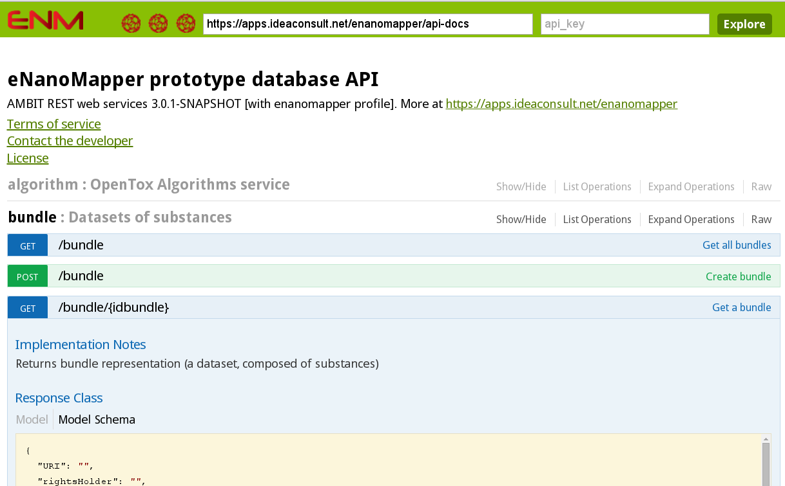

# Download data from within R

This tasks introduces you the the R packages for accessing data in an eNanoMapper instance and
will take about 15 mins. If you do not care about R, you can move on to the next chapter.
Otherwise, follow the below steps.

## Install the renm package 

The renm package is an R package to download data from eNanoMapper data warehouse instances.
It is available from: [https://github.com/enanomapper/renm](https://github.com/enanomapper/renm)

From the R command line:

```{r}
install.packages(c("curl", "plyr", "jsonlite"))
install.packages("devtools")
library(devtools)
install_github("enanomapper/renm")
```

The first line installs the dependencies of the renm package, while the second line installs a core R  package that allows one to install packages directly from GitHub. The third line loads this devtools package, and installing of renm is finally done in the fourth line.

You can then load the renm library with:

```{r}
library(renm)
```
## Browsing the data in R

The eNanoMapper API (you can [browse it interactively online](http://enanomapper.github.io/API/))
is wrapped by the renm package, hiding many technical aspects, attempting to adhere to R customs.
For example, the following commands show you how to list all bundles or list all nanomaterials
(modeled in the databases as substances):

```{r}
bundles = listBundles("http://data.enanomapper.net/")
substances = listSubstances("http://data.enanomapper.net/")
```


Figure 13: Screenshot of the webpage where you can explore and interactively try the application programming interface (API) use by the renm package for interaction with the data server.

## Download the data on the nanomaterials

The following commands can be used to download information about nanomaterials.

```{r}
substances = listSubstances("http://data.enanomapper.net/")
substanceFields = names(substances$substance)
substanceLabels = substances$substance["name"]
```

The next step is to access the physchem and bioassay data associated with the nanomaterial:

```{r}
info = substanceInfo("http://data.enanomapper.net/substance/NWKI-71060af4-1613-35cf-95ee-2a039be0388a")
experiments = info$protocol
```

And the get the first measurement:

```{r}
info$effects[[1]]
```

The structural information for the nanomaterials can be accessed in the following manner, but it's important to realize that here we see some design issues of the OpenTox API return, and the information we seek is expressed as 'features'. Furthermore, the content returned is automatically converted from the JSON returned by the service, and we need to extract too:

```{r}
structures = substanceStructures(
  "http://data.enanomapper.net/substance/NWKI-71060af4-1613-35cf-95ee-2a039be0388a"
)
features = as.vector(unlist(
  lapply(structures$feature, function(aFeature) { aFeature$title })
))
```

The listSubstances() method can also be use to do searches. For example, to list
all nanomaterials associated with a particular publication, you can use the
Digital Object Identifier (DOI) of the paper:

```{r}
substances <- listSubstances(
  service="http://data.enanomapper.net/",
  search="10.1073/pnas.0802878105", type="citation"
)
```

The list of types of searches currently supported include citation, type, and
owner_name. The list of owners you can retrieve is in this way:

```{r}
owners = listSubstanceOwners("http://data.enanomapper.net/")
codes = owners$value
```
