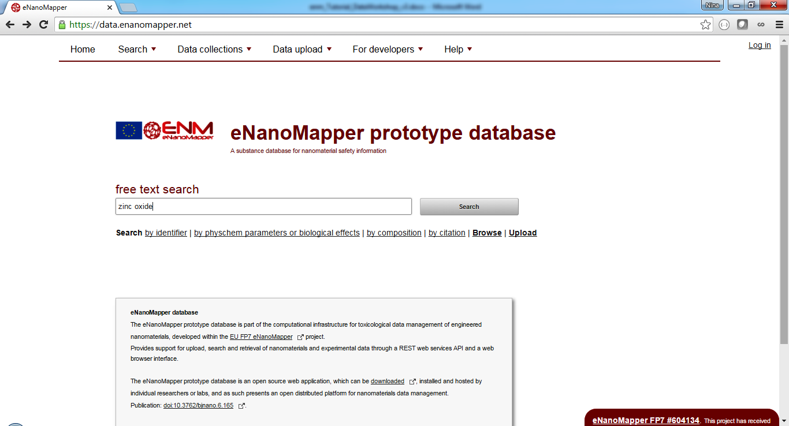
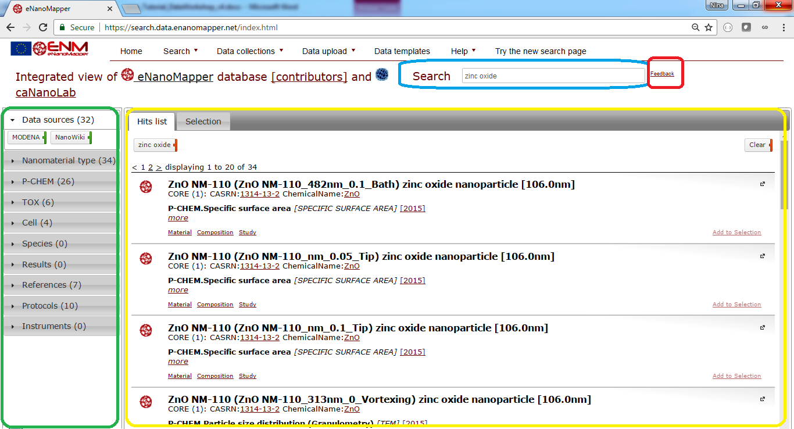
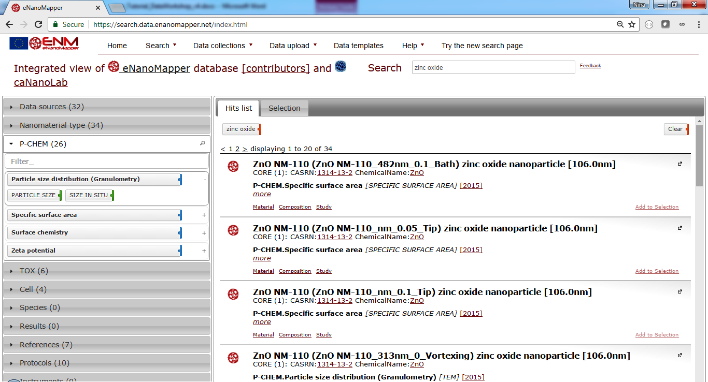
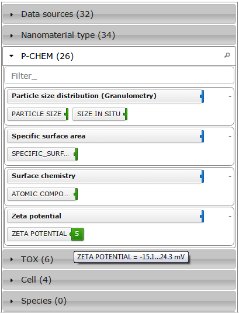

# Searching

The task outlined in this chapter is to search for zinc oxide nanomaterials.

## The Database

Go to [http://data.enanomapper.net](http://data.enanomapper.net).

## Searching zinc oxide

Enter “zinc oxide” and click on “Search” button.

This launches the search application you will explore.  The page shown in Fig. 1 appears. There is a search box (highlighted in blue, top) a summary panel (left, green) and the results are shown at the main panel (yellow). 

**Figure 1**: Zinc oxide search.

## The search results

The result page as in Fig.1 will appear. There are several summaries at the left panel as shown on Fig. 1:

* Data sources
* Nanomaterial type
* P-Chem
* Tox
* Cell
* Species
* Results
* References
* Protocols
* Instruments

Every panel is expandable and shows the types of elements found for the particular query, “zinc oxide” in this case. For example, there are two data sources shown, “MODENA” and “NanoWiki”, because these two data sources contain entries for zinc oxide particles. 

## The nanomaterial facet

Click on NanoMaterial type at the left.

**Figure 2**: The nanomaterial type panel shows zinc oxide only, because this is what the query is about.

## The physchem facet

P-CHEM stands for physico-chemical characterisation and shows a summary of the type of experiments (the tags marked with green line at the right) and endpoints (the tags marked with blue line at the right).

**Figure 3**: The P-CHEM (physico-chemical characterisation) panel shows the type and the number of entries available for different physicochemical measurements.

Mouse hovering on each tag reveals more information, as number of entries (the colored part of the tag) or ranges of the available measurement (tooltip on the tags marked blue), see Fig 4.

**Figure 4**: Summary details, e.g. shows the range of the Zeta potential measurements (-15.1, 24.3) mV
