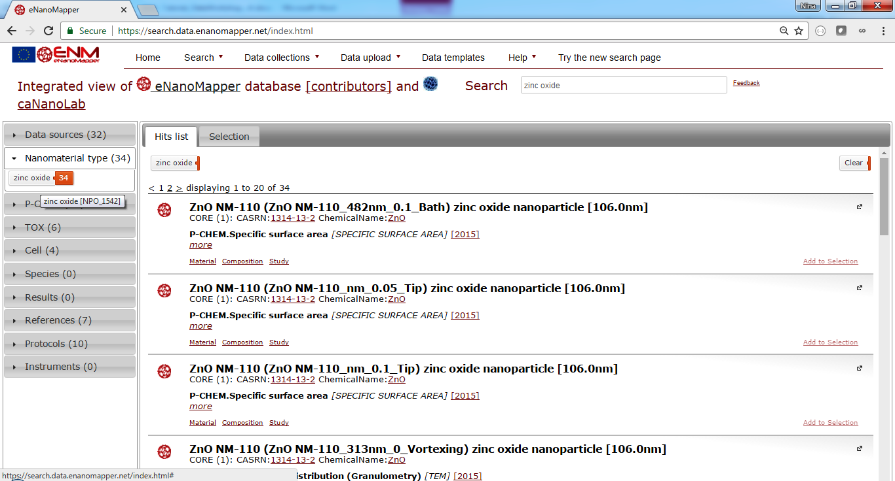
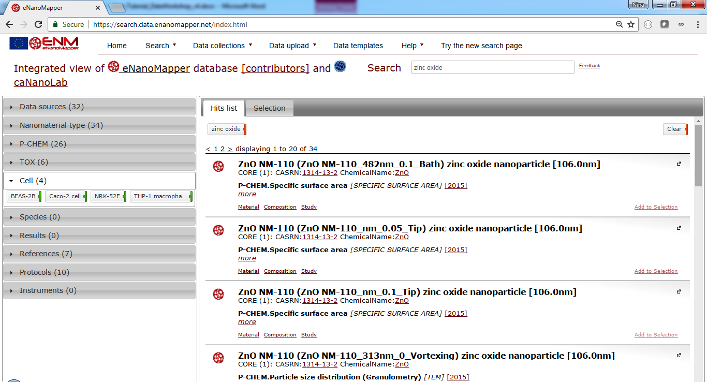

# Searching

The task outlined in this chapter is to search for zinc oxide nanomaterials.

## The Database

Go to [http://data.enanomapper.net](http://data.enanomapper.net).

## Searching zinc oxide

Enter “zinc oxide” and click on “Search” button.

This launches the search application you will explore.  The page shown in Fig. 1 appears. There is a search box (highlighted in blue, top) a summary panel (left, green) and the results are shown at the main panel (yellow). 

**Figure 1**: Zinc oxide search.

## The search results

The result page as in Fig.1 will appear. There are several summaries at the left panel as shown on Fig. 1:

* Data sources
* Nanomaterial type
* P-Chem
* Tox
* Cell
* Species
* Results
* References
* Protocols
* Instruments

Every panel is expandable and shows the types of elements found for the particular query, “zinc oxide” in this case. For example, there are two data sources shown, “MODENA” and “NanoWiki”, because these two data sources contain entries for zinc oxide particles. 

## The nanomaterial facet

Click on NanoMaterial type at the left.

**Figure 2**: The nanomaterial type panel shows zinc oxide only, because this is what the query is about.

## The physchem facet

P-CHEM stands for physico-chemical characterisation and shows a summary of the type of experiments (the tags marked with green line at the right) and endpoints (the tags marked with blue line at the right).

**Figure 3**: The P-CHEM (physico-chemical characterisation) panel shows the type and the number of entries available for different physicochemical measurements.

Mouse hovering on each tag reveals more information, as number of entries (the colored part of the tag) or ranges of the available measurement (tooltip on the tags marked blue), see Fig 4.

**Figure 4**: Summary details, e.g. shows the range of the Zeta potential measurements (-15.1, 24.3) mV

## The toxicology facet

Click on TOX panel at the left. TOX stands for toxicity assays, and shows a summary of the type of the experiments (the tags marked with green line at the right) and endpoints (the tags marked with blue line at the right).

**Figure 5**: The TOX (toxicity assays) panel shows the type and the number of entries available for different biological assays.  Hover with mouse on each tag in order to see more details.

## The cell line facet

Click on Cell panel ON the left The expanded panel will show the cell lines used in the biological ass­ays involved with zinc oxide (recall we are still exploring the “zinc oxide” search results, and the current filter is indicated by  tag ‘zinc oxide’ at the top of the hit lists).

**Figure 6**: The cell lines used in the experiments, involving zinc oxide nanoparticles.

Click on THP-1 macrophages button. The current filter will be updated with a second entry, restricting the query for zinc oxide + THP-1 macrophage. This is an illustration one can restrict the query by clicking any combination of the tags from the summary panels. The content of the result and summary panel will adapt to reflect the query results.

**Figure 7**: The cell lines used in the experiments, involving zinc oxide nanoparticles.

The content of the current filter (at the top of the hit list) can be directly modified by clicking on the tags or using the button clear, which will remove the selection and the result and summary panel content will be updated.

## Removing filters 

Clicking on the zinc oxide tag at the top of the hit list will remove the zinc oxide  from the query, retaining only the Cell line : THP 1 macrophage criteria.  The results panel and the summaries will be adapted accordingly.

As the results list is now updated, it contains particles other than zinc oxide.  Click on the Nanomaterial type to explore what particles are included in the search results.

**Figure 8**: Click on the nanomaterial type panel on the left to see the summary of nanomaterial types found in the current query.
