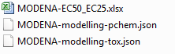
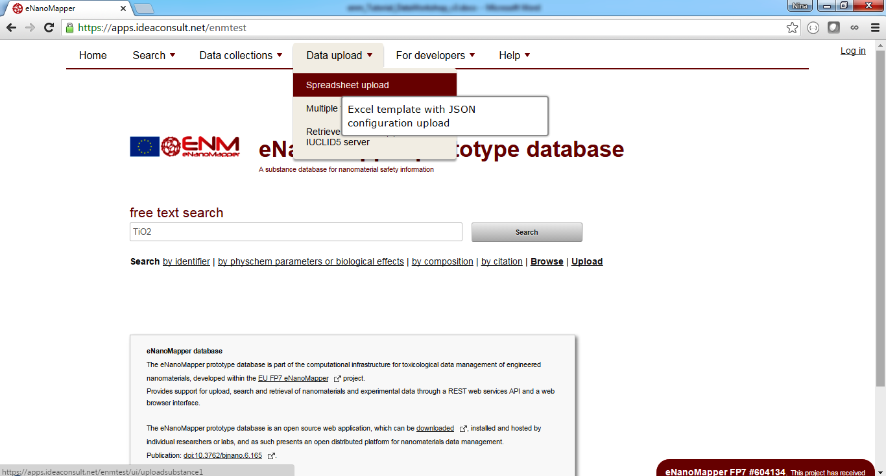
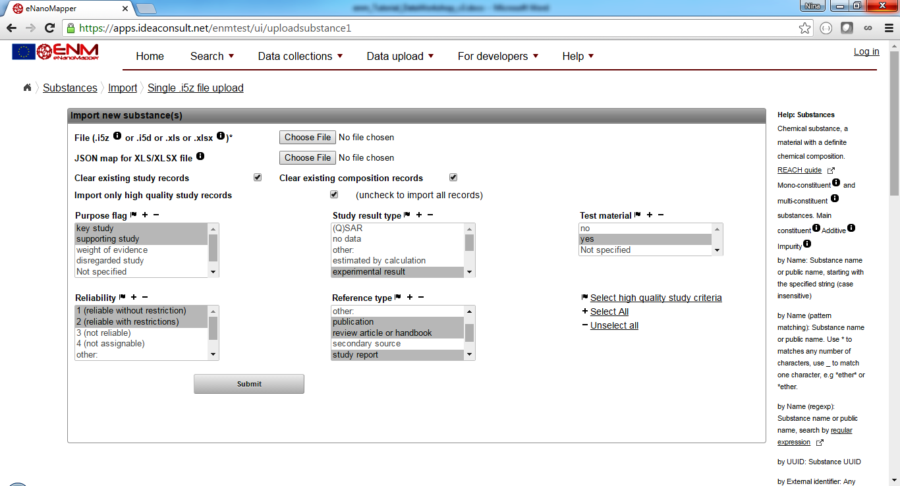
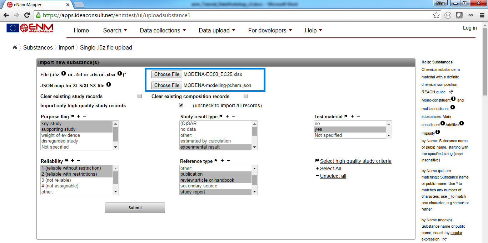
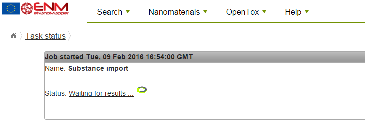
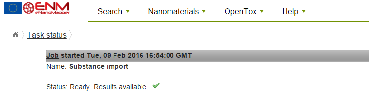
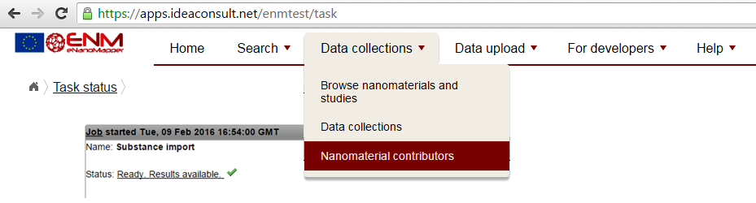
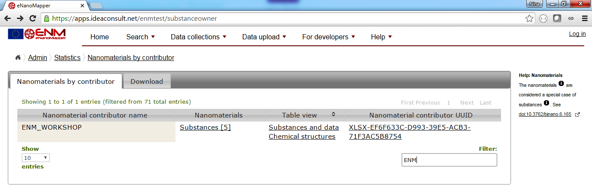
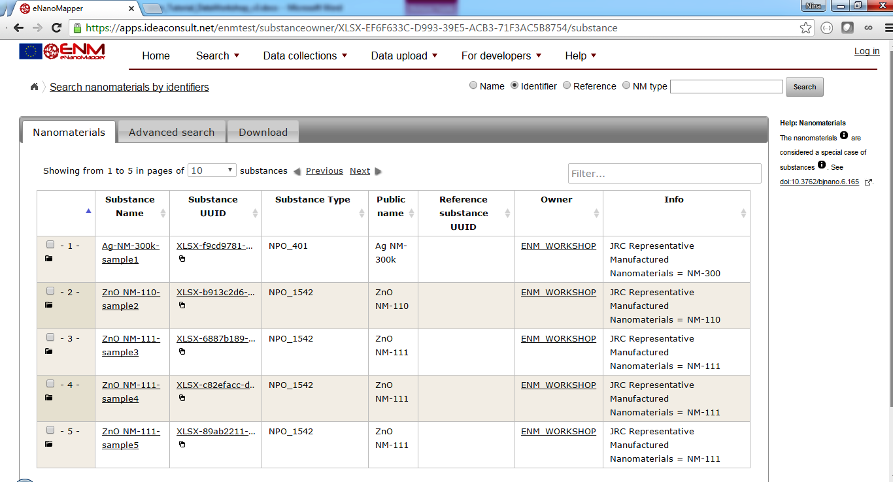
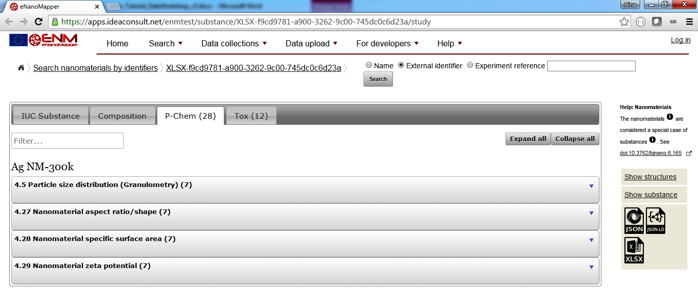

# Data preparation & Upload

The next task will be about preparing data for upload into an eNanoMapper instance.  You will look at a template with data, compiled by the [MODENA](http://www.cost.eu/COST_Actions/mpns/TD1204) COST Action project, explore the content, and upload this template into the test eNanoMapper data server [https://apps.ideaconsult.net/enmtest](https://apps.ideaconsult.net/enmtest).

The following three  files are used in the exercise: 

* MODENA-EC50_EC25.xlsx contains physicochemical and biological characterisation of two nanomaterials. The data was extracted from the literature, compiled by the MODENA project and made publicly available after the end of the MODENA project.
* MODENA-modelling-pchem.json is a configuration file, describing which parts of the Excel file MODENA-EC50_EC25.xlsx contain the physicochemical readouts and metadata of the experiment
* MODENA-modelling-tox.json is a configuration file, describing which parts of the Excel file MODENA-EC50_EC25.xlsx contain the biological readouts and metadata of the experiments
* The configuration files are written in [JSON](http://www.json.org/), a lightweight data interchange format.

## The Test Data

Download the files from this folder:

Link missing, see [this issue](https://github.com/enanomapper/tutorials/issues/15).

## The Test Server

Go to [https://apps.ideaconsult.net/enmtest](https://apps.ideaconsult.net/enmtest). This is the test server for data upload. 

## The Upload Page

Use the menu to go to the upload page: `Data upload` > `Spreadsheet upload`.

The following upload page will appear:

## Using the web form for upload

* Click on the top *Choose File* button and select the `MODENA-EC5_EC25.xlsx` file.
* Click on the bottom *Choose File* button and select the `MODENA-modelling-pchem.json`
* Uncheck the *Clear existing study records*
* Uncheck the *Clear existing composition records*
* Click *Submit*

Clicking the *Submit* button starts the upload task, the following screen appears:

On completion, the status page changes to *Ready. Results available*:

## View the uploaded materials

Clicking on the link will lead to the uploaded materials.
Alternatively, use the menu *Data collections* > *Nanomaterial contributors* to display the datasets.

* Look for the *Nanomaterial contributor name* ENM_WORKSHOP (*Hint: use the Filter function, marked in blue*). 
* Click on the substances link to explore the uploaded content (*marked in red*).

The list of materials uploaded appears as shown in the next screenshot:

Each link in the columns *Substance name* leads to a detailed page with study details. Use the *Expand all* buttons to display and explore the results:

    
## Upload MODENA biological characterisation data

