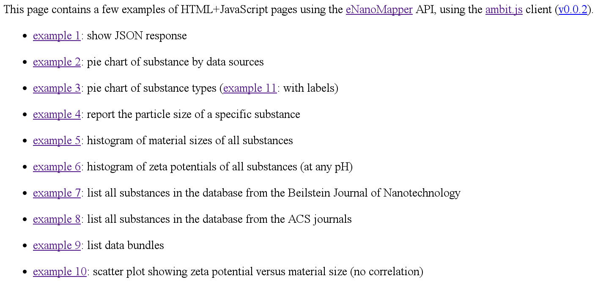
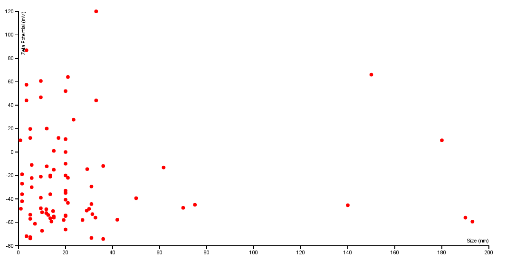
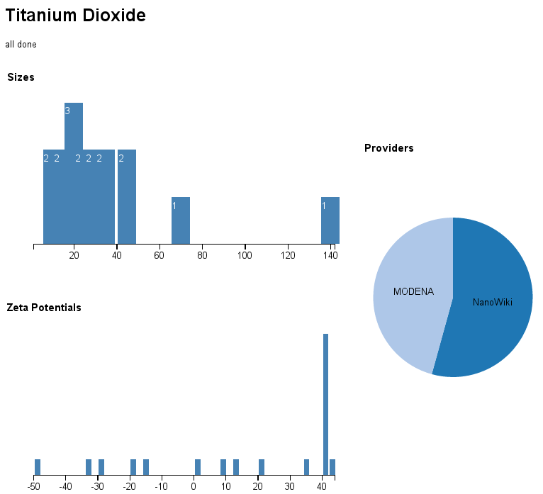

# Data visualization

The last task of this tutorial shows you another advantage of Application Programming Interfaces: it is easy to reuse in different frameworks. Here, we show visualization of data with many HTML and JavaScript, using various libraries.

## Browse the examples

Go to the following website and try the [various examples](http://enanomapper.github.io/ambit.js/).
These JavaScript-enriched HTML pages use [ambit.js](https://github.com/enanomapper/ambit.js/) and
[d3.js](https://d3js.org/) (mind you, these examples to not do justice to the features of d3.js!).

Particularly, check [example 5](http://enanomapper.github.io/ambit.js/example5.html),
[example 9](http://enanomapper.github.io/ambit.js/example9.html),
[example 10](http://enanomapper.github.io/ambit.js/example10.html),
and [example 11](http://enanomapper.github.io/ambit.js/example11.html).

## Titanium dioxide

Open this page to view a summary of titanium dioxides in data.enanomapper.net:
[http://enanomapper.github.io/ambit.js/titaniumoxide.html](http://enanomapper.github.io/ambit.js/titaniumoxide.html)

