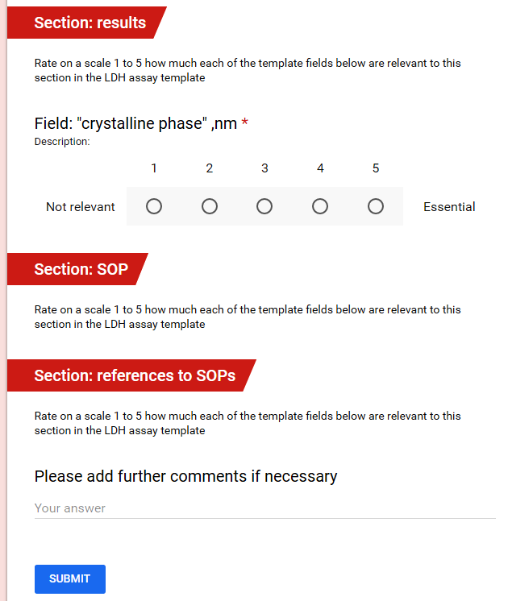

# JRC/NANoREG templates fields relevance questionnaire

## NANoREG templates

The NANoREG templates are developed by JRC with collaboration with FP7 NANoREG project partners and [released](http://www.nanoreg.eu/media-and-downloads/templates) under open license.

The NANoREG templates are organized as one spreadsheet per assay, multiple NM can be entered as rows. One Excel file may contain more than one assay, measuring the same endpoint. The metadata is organised in several groups:

* Sample information. Contains information about the NM (including names, ID, supplier, vial number and replicate number, as well as dispersant). The reporting organisation, operator and date of the experiment are also in this section.

* Unnamed group listing the module, the endpoint, and the assay name. 
  
   - module (phys-chem, in-vitro or in-vivo),
   
   - endpoint (e.g. cell viability)

   - assay name (e.g. “Alamar blue”).

* Method and instrument information. Any parameter describing the experiment, including cell lines, instrument, controls, time points, concentratons. These differ widely across different experiments.
* A subgroup `size distribution` , providing placeholders for size distribution measured for the sample (including details on the dispersion protocol and dispersion medium). These fields are (almost) constant across all templates.

### Results

Several columns to specify measurement outcomes, along with uncertaintly.
SOP (reference to the protocol)

## The questionnaire

The questionnaire follows the NANoREG templates structure. There are one questionnaire per template (links below). Each questionnaire consists of several sections, corresponding to the section of the template. Each section consists of questions asking to estimate how much the field listed in the section is relevant for the data entry template.

## Phys-chem characterisation

* [Batch dispersion](https://goo.gl/forms/efOgw8NW4zFKX0tD2)

* [Crystalline phase](https://goo.gl/forms/wJbVd10FD1DMjLky1)

* [Elemental composition](https://goo.gl/forms/zdiNs7TZjlrxwYNh1)

* [Isoelectric point](https://goo.gl/forms/J9qLcOaiZuL0Q60M2)

* [Size by TEM](https://goo.gl/forms/eJ2dX1gaLSBbPqW92)

## In vitro assays

* [Genotoxicity by COMET assay ](https://goo.gl/forms/Q48apDQKeJGoqGor2)

* [Template: In-vitro Immunotoxicity Cytokine secretion](https://goo.gl/forms/sL8hdf6gZwd8Ihqw2)

* [Genotoxicty Micronucleus](https://goo.gl/forms/PNlOaMuxr0CBgRhs2)

* [Cytotoxicity by LDH assay] (https://goo.gl/forms/zNugQJTwfgwwZpHI2)

## In vivo assays

* [Ecotoxicity - Danio rerio](https://goo.gl/forms/bFR4yhHoOkyBgRAj1)

* [Inhalation - DNA Damage lung](https://goo.gl/forms/UXzBDICKD11uDf122)

* [Immunotoxicity by FACS analysis](https://goo.gl/forms/QxtfogyV9ruN5m563)

* [In-vivo Cytokine secretion MPh](https://goo.gl/forms/A2lGTMJGMo5fjRPP2)
