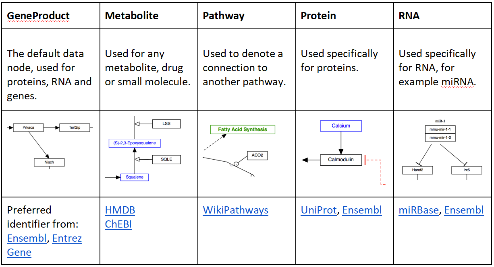

# How to make a new pathway for WikiPathways using PathVisio

* RELEASE DATE: 31.5.2016
* VERSION: V.1.0.
* MAIN AUTHOR: Friederike Ehrhart                                                                       
* AUTHORS:  Martina Summer-Kutmon, Egon Willighagen, Kristina Hanspers, Alexander Pico, Penny Nymark, Linda Rieswijk
* LICENSE: Creative Commons Attribution (CC-BY) 4.0

## Introduction

### What is WikiPathways

WikiPathways was established to facilitate the contribution and maintenance of pathway information by the biology community. WikiPathways is an open, collaborative platform dedicated to the curation of biological pathways. WikiPathways thus presents a collaborative model for pathway databases that enhances and complements ongoing efforts, such as [KEGG](https://www.genome.jp/kegg/), [Reactome](https://reactome.org/) and [Pathway Commons](http://www.pathwaycommons.org/pc/). Building on the same MediaWiki software that powers Wikipedia, WikiPathways added a custom graphical pathway editing tool and integrated identifier databases covering major gene, protein, and small-molecule systems. The familiar web-based format of WikiPathways greatly reduces the barrier to participate in pathway curation. More importantly, the open, public approach of WikiPathways allows for broader participation by the entire community, ranging from students to senior experts in each field. This approach also shifts the bulk of peer review, editorial curation, and maintenance to the community.

### Why Pathways

Strictly speaking, one could argue that pathways don't exist... there are only parts of more complex networks. Nonetheless, pathways have proven themselves as  useful models in biomedical research. Biological pathways provide intuitive views of the myriad of interactions underlying biological processes. A typical signaling pathway, for example, can represent receptor-binding events, protein complexes, phosphorylation reactions, translocations and transcriptional regulation, with only a minimal set of symbols, lines and arrows. These powerful representations are essential tools, common among the textbooks and review articles that document any given field of biology. Making these tools available for computational methods of analysis will allow researchers to connect pathways to databases of biological annotations and experimental data, creating effective products of systems biology. Collecting and maintaining pathway information in a robust database, however, is an ongoing challenge.
For nanosafety research, knowledge on biological pathways is expected to help the community with analysis and interpretation of omics data. Building of new pathways and annotation of existing pathways can benefit nanosafety research, since a subset of relevant curated pathways could be useful for more targeted risk analysis purposes. Focused subsets of relevant pathways avoid the biological noise that comes with wide scale pathway sets across multiple cell types, tissues and species. Furthermore, linkage to AOP may help in making pathways more relevant for other than scientific purposes. 

### How Does it Work

Each pathway at WikiPathways has a dedicated wiki page, displaying the current diagram, description, references, download options, version history, and component gene /protein  and interaction lists. Any pathway can be edited from within its wiki page by activating an embedded pathway editor. After editing, an updated pathway image is displayed on the wiki page along with the version history and list of component genes and proteins. Users can easily monitor and undo changes, compare differences and search for overlapping pathways. Using the search feature, one can locate particular pathways by name, by the genes and proteins they contain, or by the text displayed in their descriptions and comments. One can also browse the collection of pathways with combinations of species names and specific pathway collections. The pathway content at WikiPathways is freely available for download in a variety of data and image formats, including GPML (Graphical Pathway Markup Language), which is a custom XML format compatible with pathway visualization and analysis tools such as PathVisio, GenMAPP and Cytoscape. New features are added all the time. Visit the [Help pages](https://www.wikipathways.org/index.php/Help:Contents) to learn how to use the latest features.

This information is from: [http://www.wikipathways.org/index.php/WikiPathways:About](http://www.wikipathways.org/index.php/WikiPathways:About) 

### Scope of this tutorial

This tutorial shows users how to make a biological (or biochemical) pathway for WikiPathways using the software PathVisio. The information and images are derived from help pages of WikiPathways with some recent updates.  Pathways can be created from e.g. comprehensive  images in reviews showing the interactions of genes, proteins and metabolites in a good graphical way. Pathways can show molecular biological interactions like signal cascades, enzyme reactions, transport mechanisms of “healthy” pathways, drug or nanoparticle interactions, adverse outcome pathways and diseases. 
You can find examples for nanomaterial specific pathways and discussions in the [nanomaterials portal](https://www.wikipathways.org/index.php/Portal:Nanomaterials) of WikiPathways. 

## Application Details

### General guidelines

Create an account
To edit pathways or contribute new pathways, you need an account on WikiPathways. To start contributing, sign-up by [creating an account](https://www.wikipathways.org/index.php/Special:UserLogin). Make sure to verify the account by clicking on the link sent by mail before any other action. Once you have created an account, you can customize your user page with relevant information, such as your affiliation, contact information etc. To edit your user page, click on your user name at the top of any WikiPathways page.

Pathway naming
* All contents of a pathway, including entities of the graphical representation (data node labels, labels, comments) and description, should be in English.
* Pathways should have a descriptive name, like “Cholesterol Biosynthesis”.
* Do not include your name or username in the pathway name. Species name or species codes are also not recommended in pathway names because this will be added to the pathway automatically.
* Try to pick a name that is unique at WikiPathways, to avoid having multiple pathways with the same name. If a similar pathway with the same title already exists, try to specify what makes your pathway special/different.
* If your pathway is specific to a particular state or tissue, this may be included in the name, for example as a prefix or suffix or use the cell type ontology.
* If the pathway is based on content from an external source, the name of the source may be included in the name, for example as a prefix or suffix.

Pathway annotation
Properly annotating pathways is essential to maintain a high quality of curation and content at WikiPathways. Annotation includes adding one or more ontology tags, defining each data node in the pathway with a database identifier and adding a description for each pathway. If available add identifiers to interactions (e.g. metabolic reactions from the Rhea database).

Content forking
If you plan to add tissue- or state-specific information to a pathway describing a general process, please create a new pathway and copy the relevant content from the original pathway, rather than making edits directly to the original pathway. When naming the new related pathway, it is appropriate to use the name of the original pathway, with a suffix or addition explaining the edits. This will ensure that pathway names are not duplicated and will help in organizing related pathway content.

Pathway boundaries
Multiple pathways may overlap or correspond to the same topic, but each should serve a unique goal in what it represents. First browse the current contents at WikiPathways to avoid duplicate work. Browsing related pathways can also give you an idea of appropriate pathway boundaries.

### PathVisio
PathVisio [http://www.pathvisio.org/](http://www.pathvisio.org/) is a free software for pathway editing, analysis and visualization. For description about how to use the analysis function see this [tutorial](https://docs.google.com/document/d/1p8rn_TbnawWDYFw18HS5Lin0tMb5t6h6ULZ5gLjDP2I/edit). PathVisio can also be used to draw new and edit existing pathways from WikiPathways. The WikiPathways Client plugin for PathVisio [http://www.pathvisio.org/plugin/wikipathways-plugin/](http://www.pathvisio.org/plugin/wikipathways-plugin/) connects to WikiPathways and allows users to search and browse pathways from within PathVisio, and upload new or adapted pathways to the database. 
Installation
* Make sure that Java is installed on your computer. PathVisio requires Java.
* Download and start [PathVisio](http://www.pathvisio.org/downloads/).
* Open the via Plugins -> Plugin Manager.
* In the Available tab, click the Install button for WikiPathways plugin. When successfully installed the plugin will be displayed in "installed plugins".

Adding gene and metabolite bridge.db files
* Download and unpack the BridgeDb identifier mapping databases for the species you would like to use: [http://www.pathvisio.org/downloads/download-bridgedbs/](http://www.pathvisio.org/downloads/download-bridgedbs/)  
* In PathVisio, you can load the identifier mapping databases:
  * Data -> Select Gene database -> add the link to the BridgeDb file (species specific!)
  * Data -> Select Metabolite database -> add the link to metabolite BridgeDb file (not species specific)

### How to make a basic pathway - example of statin pathway
Videos:

[WikiPathways: Create a pathway, part 1](https://www.youtube.com/watch?v=N7cGHJ6HdGU)

[WikiPathways: Create a pathway, part 2](https://www.youtube.com/watch?v=A_ZWFXjtpNQ)

[WikiPathways: Create a pathway, part 3](https://www.youtube.com/watch?v=5qaWMwRh0Lk)

Create a new pathway
Open a new browser window or tab, go to the WikiPathways main page and click the image under the header Create in the Contributing New Pathways section. You can also click the Create link in the left-hand side panel. Enter Demo_yourname under the Pathway name field and select Homo sapiens in the species menu. Now click the Create pathway button.
After clicking the button, a new page will open and the pathway editor will be loaded.
Open the editor in a separate window by clicking the Switch to fullscreen mode button . This allows you to resize the editor and edit fullscreen. You can return to the original editor in your browser by clicking the Switch to embedded mode button .
You can now start drawing your pathway on the [drawing area](https://www.wikipathways.org/index.php/Help:Tutorial).

Adding initial gene products and metabolites
For the purposes of this tutorial, we will use the Statin pathway as our example. We will start by adding a data node to the pathway. On a WikiPathways pathway, all biological entities with an annotation are stored as a data node. A data node can have different types, in this case, we will use the type Metabolite.
* To start, click the drop-down next to the GENE button  and select Metabolite. Place the metabolite on the drawing are by dragging and dropping it.
* To annotate the node, double-click the metabolite to bring up the DataNode properties interface. In the Annotation tab, type in 3-hydroxy-3-methylglutaryl-coA and click Search.
Note that you can also manually fill in identifier and data source either in the DataNode properties interface or in the Properties tab in the right-side panel.
* In the search results, select the node with the HMDB identifier HMDB01375. Click OK.
* Back in the DataNode properties window, you can alter the text label that will be displayed on the metabolite. In this case, change it to HMG-CoA. Click OK to save.
Note that the text in the text label field will be displayed on the pathway and doesn't affect the annotation.
* Repeat the steps above and add another metabolite node for Mevalonate. Place it under the HMG-CoA node.
After annotating a data node, you check whether it's correctly annotated by selecting the data node and. Annotation info should appear in the ' 'Backpage' ' tab of the side panel.

Note: Sometimes a gene symbol may not be found via the search feature. This is because some genes has two synonymous names, but only one is stored in the internal database. In this case, the data node has to be manually annotated.

Add interactions
Next, we need to connect the two metabolites:
* In the drop-down next to the Interaction button, select Conversion from the MIM interactions section. Place the interaction on the drawing area.
* To attach the interaction, click on the non-arrow end of the interaction to select it, and drag it towards the HMG-CoA node. Red link anchors on the node will become visible as you drag the interaction towards it. Hover over a snap target to select it; it will be highlighted in green when selected. Simply let go of the interaction when you see the target highlight, and the interaction will attach.
Note that you can release an interaction from it's link target by moving the interaction end away from the link anchor.
* Repeat the process to attach the arrow-end of the interaction to Mevalonate.
* Once the two nodes are connected, you can move them by clicking and dragging to adjust the alignment and layout.

Note: It's good habit to connect the lines in your pathway wherever you can. It makes it easier to change the layout of the pathway in the future, because when you move an object, the connected lines will stick to it. Another advantage of defining connections is that it enables conversion of the pathway to graph format. When the interactions between the entities in the pathway are explicitly defined, this information can be used for computational purposes. For example, the pathway can be converted to a Cytoscape network to perform various graph analysis algorithms (see [http://www.cytoscape.org](http://www.cytoscape.org/)).

Add enzymatic reaction
We can now add the enzyme that converts HMG-CoA to Mevalonate, HMGCR:
* Add another data node of the GeneProduct and annotate it as HMGCR.
* Add an interaction of type Catalysis, under MIM interactions.
* Connect the start (plain) end of the catalysis to the left short-end of HMGCR.
The catalysis interaction works on the existing interaction between HMG-CoA and Mevalonate. To connect the catalysis interaction to this interaction, we first need to add an anchor to the conversion interaction.
* To add an anchor, right-click on the conversion interaction and select Add anchor. You can adjust the position of the anchor by click and drag.
* Attach the catalysis interaction to the anchor.

Add inhibition of the catalysis by Statin
We can now add the inhibition of the catalysis by Statin.
* Add another metabolite data node. In the DataNode properties interface, search for Statin. There will be multiple results, choose Pravastatin. For simplicity, change the text label to Statin.
* Now, add an interaction of type Inhibition (under MIM interactions) and connect the plain end to the Statin node.
* Add an anchor on the HMGCR catalysis interaction.
* Connect the inhibition end of the new interaction to the anchor.
* To make the interactions easier to read, change the style of the inhibition interaction to an elbow. You can do this by right-clicking the interaction and selecting Line type > elbow.

Changing the color and style of interactions
Inhibitions are often depicted as red in pathway illustrations, so in keeping with this convention, let's change the color of the inhibition to red:
* Select the inhibition interaction.
* In the right-side Properties panel, change the color to red.

Saving changes
* To save the pathway, click the Save the pathway to WikiPathways.org button .
* Exit full-screen mode by clicking the Switch to embedded mode button .
* When the pathway is saved, close the applet using the  button. Your browser will be redirected to the pathway page. You will see an image of the pathway you have created.

Note: You can also save the pathway locally on your hard drive, using the Export button  button and selecting 'gpml' as file type. Saving a pathway locally once in a while is usually a good habit to prevent losing your changes when an error occurs.

Adding a cellular compartment
* To add a cellular compartment shape to the pathway, select the Cell shape  button from the right-side Objects panel and place it on the drawing board.
* Size and position the cell shape to fit all the pathway entities. The cell shape should be a large rectangle.

Adding labels
When using cellular compartments in a pathway, add labels for clarity:
* In the toolbar, click the Label button  button and place it at the bottom right corner of the cell shape.
* Double-click the label to open the Label properties interface, and type in Liver cell. In this interface you can also change the font style and size of the label.
* Repeat these steps to add another label just outside the cell shape, for Plasma.
Label text and style can also be edited in the Properties tab of the right-side panel.

Illustrating transport
To illustrate the transport of cholesterol out of the liver cell, we place a copy of the cholesterol node in the area representing plasma:
* Select the cholesterol node, and click the Copy selected pathway objects to clipboard button  in the toolbar.
* Next, click the Paste pathway objects from clipboard button . This creates a new copy of the cholesterol node.
* Place the copy of the node outside the liver cell, under the original copy of the cholesterol node.

Creating and connecting complexes
The transport of cholesterol out of the liver cell is facilitated by a transfer protein complex, composed of MTTP and PDIA2.
* Add two new GeneProduct data nodes and annotate them as PDIA2 and MTTP.
* Select both nodes either by Command+Click or click and drag.
* In the toolbar, click the Stack vertical center button  button to stack the nodes.
* To create a complex, first select the two nodes again and then right-click and select Create complex, or clicking Ctrl-P.
* Place the complex in the plasma membrane, under SOAT1.
Next, we can illustrate the transfer of cholesterol by adding an interaction:
* Add an interaction of type MIM conversion and connect it to go from the intracellular cholesterol node to the extracellular cholesterol node.
* Next, add an anchor to the interaction.
* Add a new interaction of type MIM catalysis.
* Connect the catalysis interaction from the MTTP/PDIA2 complex to the anchor on the transfer interaction.
* Finally, move the complex to the right so that it is placed in the plasma membrane on the cholesterol transfer interaction.

Adding a literature reference
Since we have a literature reference describing how MTTP/PDIA2 facilitates cholesterol transfer, we can add it to the MTTP/PDIA2 complex:
* To add a literature reference to the complex, right-click on the complex and select Literature > Add literature reference.
* In the Literature reference properties type in the PMID for the reference and click Search. When the PMID is found, the fields are completed. You can also manually fill in the reference information manually as well.
* Double-check that the correct reference was found, then click OK.
* Save your pathway to WikiPathways, and enter a description for your changes when prompted.
* Exit full-screen mode and close the editor.

Note: You can add references to any individual element or groups. You can also add a general reference at the pathway level by right-clicking the pathway infobox and selecting Literature > Add literature reference

Saving changes
* To save the pathway, click the Save the pathway to WikiPathways.org button .
* Exit full-screen mode by clicking the Switch to embedded mode button .
* When the pathway is saved, close the applet using the  button. Your browser will be redirected to the pathway page.

Adding a description
You should add a description to your pathway, so other people can easily see what the pathway is about. You can also use the description field to explain features of your pathway in more detail or to highlight parts that need to be improved.
Add this description to the pathway by clicking the Edit button  under the Description section on the pathway page. A text editor field will appear below the description header where you can type or paste the description. Click Apply button  to save the description. The pathway page will now reload and you will see the description you added appear in the description section.

Adding curation tags
Curation tags are short messages that can be added to notify the community about the state of the pathway. See the help page for more information.
In this step, you are going to add a curation tag that tells other users this pathway is a tutorial pathway. This will also exclude this pathway from the download archive. Pathways marked with the tutorial pathway tag are also cleaned up periodically by the WikiPathways administrators.
To add the "Tutorial pathway" tag to your pathway, press the new button  in the Curation tags section. Choose Tutorial pathway in the dropdown list and press the Apply button . You will now see the following message below the pathway image:
 This is a tutorial, demo or test pathway.

### Curator guidelines
Below are our recommendations on specific aspects of editing that best utilize the tools and data model. In terms of graphical style, it is up to the individual author of a pathway to create a style that best displays the relevant information. WikiPathways does not enforce a particular graphical style.

Recommended use of pathway elements

For the recommended use of the most commonly used elements of the WikiPathways editor palette, see our Editor Palette Guide:

Data nodes

Adding comments and annotations

Right click on the data node and select Properties. The first tab allows to add free text Comments. 

To add database identifiers click on Annotation. You can either search for identifier or enter the label and identifier manually. The Text label should be the preferred name for the gene product (according to [HGNC](https://www.genenames.org/about/guidelines) guidelines), the Identifier is the accession number or code of that entity e.g. ENSG00000169057 in the Ensembl database for MECP2 (human gene). The icon for Database allows to scroll for the correct database from which the identifier is taken. 

All items in the Properties will be displayed as a list (list of comments, list of external identifiers, list of literature)  once the pathway is online on WikiPathways. 

Basic Interactions

Line / Arrow

The solid line and arrow are used to denote a variety of processes, including conversion, translocation, activation, binding and modification.

Dashed line / dashed arrow
The dashed line and arrow are used to denote an uncertain process or a process that involves additional steps not outlined in the diagram.

T-bar

The T-bar is used to denote inhibition.

Line types

Any interaction can have a line style of either straight, curved, elbow or segmented. The default style is straight, and is shown in the examples above. The other three line styles are used to increase readability or to allow for a specific layout.

MIM Interactions - Molecular Interaction Maps
The WikiPathways editor includes a set of MIM interaction types, based on the [Molecular Interaction Maps](https://www.genenames.org/about/guidelines) notation. Refer to the [formal MIM specification](https://discover.nci.nih.gov/mim/formal_mim_spec.pdf) for details on recommended usage.

Graphical elements

Graphical elements are purely graphical, meaning they do not have a meaning in the network graph that defines nodes and interactions.

Label

Labels are used to describe locations, entities, processes or context:

  
Line

Lines can be used to create more complicated graphical objects representing biological structures, or to create a pathway legend.

Arc

The arc is typically used to denote a cellular or molecular structure.

Rectangle

The rectangle is typically used for headers, to create an outline for a legend or as a purely graphical object:

Cellular compartments

Cellular compartment shapes are used to specify the cellular location of processes. Using the defined cellular compartment shapes instead of simple graphical shapes ensures that the cellular location information is encoded in the GPML.

Representing complexes

Representing molecular complexes can be done in a variety of styles. We recommend using a “create complex” (or Ctrl + P) whenever possible. In the example below, the human RNA Polymerase I subunits are represented as a stack.

Sometimes, you might also likely want to "group" a set of  stacked genes. Once selected, genes can be grouped by pressing CTRL + G, or choosing 'group' in the right-click menu. 

Representing reactions

When two reaction steps follow each other in a pathway (i.e. the product of reaction A is the substrate for reaction B), it is best to use a single element for this entity.
On the other hand, common entities that are involved in many reactions may be drawn as multiple entities for clarity, so you do not get a large messy hairball. Common metabolites include H2O, H+, ATP, NADH.

Certain common metabolites that are unimportant for understanding of the pathway as a whole, such as H2O and H+ may even be left out altogether.

Representing enzymatic reactions

In order to properly store enzymatic reactions in the WikiPathways data model, place a line anchor on the line connecting the two reactants, then use a second connector from the enzyme to the anchor to denote the enzymatic interaction. To add an anchor to a line, right-click on the line and select 'Add Anchor'.

Stoichiometry

The stoichiometry of reactions is not usually modeled in WikiPathways. If you wish you can add this information as a comment attached to a reaction or you can use the label for a metabolite to indicate stoichiometry, as suggested below.

Representing multiple similar reactions

Representing multiple similar reactions so that they are properly stored in the underlying data model can sometimes present a challenge. Below is an example of using a connector hub (a line anchor) to display this. Right-click on any line to add a line anchor, then connect multiple lines for different reactions to this hub.

Using labels

To enter text for a label, double-click on the label (or choose 'Properties' in the right-click menu) and use the Label Text area to type the label, including line returns. The label can consist of multiple lines of text. You can also outline a label by choosing 'Rectangle' or 'RoundedRectangle' from the 'Outline' field in the properties panel

Representing metabolites

Metabolites and other small molecules should be represented as a data object connected to a database entry (like genes and proteins). Use the 'Met' button in the editor to create a metabolite object. Double-click the object to fill in the textlabel, identifier and database, or simply search by name or identifier.

Representing interactions

Complicated connections involving curves or corners can easily be managed using "smart connectors". Any line or arrow can be made to curve or bend by choosing 'Curved','Elbow' or 'Segmented' for 'Line type' in the right-click menu. Connect the ends of the line to their targets and the connector will bend where necessary. You can select the line again to adjust the way points of the path (blue diamond handles).

Replace arc/arrowhead combinations with curved or elbowed connectors.

These options should help you style your pathway so that it is easy to "read" and has a layout that is familiar to any biologist or biochemist.
To make sure you've connected all your lines, press CTRL-L to reveal all unlinked line ends and highlight them in green.

Representing cellular compartments

Representing cellular compartments as graphics is a useful way to illustrate location spatial relationships between objects and where processes take place. While cellular compartments can be illustrated in a number of ways, we recommend using an oval or line (or double line) with line thickness of 5 and colored light grey. In the example below, the nucleus is depicted in this way.

Grouping objects

To group objects, first select the objects to be grouped by click and drag. Grouping the objects can be done in two ways: either right-click and select Group from the context menu or click ^G on your keyboard. The display of grouped objects does not change once the objects are grouped. When the cursor is placed over a group, a boxed outline will appear highlighting the grouped objects.

Complexes
To create a complex, first select the objects in the complex by click and drag. Creating the complex can be done in two ways: either right-click and select Group from the context menu or click ^P on your keyboard. The display of a complex includes a boxed outline around the group.

Groups
Grouped objects and complexes can be selected as a group, or as individual objects. To select the group as a whole (all group objects), click anywhere in the boxed outline surrounding the group. For complexes, this outline will be permanently visible, and for groups this outline will be visible only when the cursor is placed over the group. To select an individual object in a group, click the object directly.

Adding connectors between objects

Connecting line objects with gene and metabolite objects on pathways are important for properly storing the biological interactions that the pathway represents. To connect the end of a line to a gene or metabolite, select the endpoint of the line and drag it close to the object you wish to connect it to. A set of anchor points will appear on the outline of the object. Drag the end of the line over any of these anchor points until the anchor point turns green, then let go of the line end. This will connect the end of the line to the anchor point on the object.

Objects that have anchor points that can be connected to lines are data nodes, metabolites, labels and graphical objects. Anchor points can also be added to lines (from the right-click menu), after which other lines can be connected to it.

For layout reasons and to properly represent biological interactions, non-straight lines are sometimes ideal. To create a curved, elbowed or segmented line, first create a new line by selecting the line object from the tool bar and dropping it on the canvas. Right-click on the line and under Line Type, select either Curved, Elbow or Segmented. The Curved option will produce a curved line with smooth edges, whereas the Elbow option will create a curved line with 90 degree edges. The Segmented option will let you define a line with one or more waypoints. To position the line, attach the end points to the desired objects as described above. The shape of the curved line will automatically adjust to fit the layout of the objects you are connecting. You can also change the shape of the line manually by dragging the way points (blue diamonds) on the line.

To create a line which is a composite of two or more lines, add an anchor point to one of the lines by using the right-click menu. Connect the end point of the other line to the anchor point as described above. Anchor points on lines can be moved by clicking and dragging to a desired position on the line.

### Example pathways
The content of WikiPathways is diverse in both style and content. In addition to the above graphical style guidelines, we have identified a list of example pathways that are considered well-formed in terms of annotation, representing interactions and overall layout.

[Apoptosis (Homo sapiens)](https://www.wikipathways.org/index.php/Pathway:WP254)

[Nanoparticle-mediated activation of receptor signalling (Homo sapiens)](https://www.wikipathways.org/instance/WP2643)

[Lung fibrosis (Homo sapiens)](https://www.wikipathways.org/instance/WP3624)

You can find a list of all featured pathways [here](https://www.wikipathways.org/index.php?title=Special:CurationTags&showPathwaysFor=Curation%3AFeaturedPathway).

You can find nanomaterial specific pathways and discussions in the [nanomaterials portal](https://www.wikipathways.org/index.php/Portal:Nanomaterials) of WikiPathways.

### Upload the new pathway to WikiPathways

Select Plugins -> WikiPathways -> Upload New. You will be asked to specify your login information and a description of the pathway.

Text fields on Pathway Page is edited like any other text on a wiki. Please refer to the [WikiMedia](https://meta.wikimedia.org/wiki/Help:Wikitext_examples) website for details on formatting.

Bibliography
Each Pathway Page includes a Bibliography section, designed to hold reference information relevant to the pathway. It will automatically show any literature added to single data nodes or interactions in the pathway. 

Ontology Tags
The Ontology Tags section contains any ontology tags added to the pathway. 

References to literature
Citing peer-reviewed publications is a quality standard in the scientific community and WikiPathways is no exception. We strongly encourage including relevant literature references both at the pathway level and for individual interactions in pathways.

References to other sources
For all pathway content from sources other than the scientific literature (for example commercial software products), please cite the source in the Bibliography section and add an description of the original source in the Description section. It is also a good idea to check the EULA (End User License Agreement) for any external source of pathway content.

### Modification of existing pathways

Making major edits
When making major edits (deletions in particular) to an existing pathway not created by you, first suggest the changes on the pathway Discussion page, as a courtesy to the original author. Starting a discussion about the proposed changes is a productive way of community editing.

Pathway curation guidelines from external resources
Guidelines developed by other resources can also be consulted. While much of the material may be specific to their curation tools, there are general rules that apply to any pathway curation effort... where sloppy biology must be systematically modeled and ultimately displayed on a page.

* Peter Karp and the BioCyc group provide an excellent and thorough specification to help guide all aspects of the curation of metabolic pathways: [BioCyc guidelines](http://bioinformatics.ai.sri.com/ptools/curatorsguide.pdf).
* Reactome hosts a wiki where they've posted the [Reactome Curator Guide](http://wiki.reactome.org/index.php/Reactome_Curator_Guide)
* Kitano H, Funahashi A, Matsuoka Y, Oda K: Using process diagrams for the graphical representation of biological networks. Nat Biotechnol 2005, 23(8):961-966. [pubmed](https://www.ncbi.nlm.nih.gov/pubmed/16082367?ordinalpos=3&itool=EntrezSystem2.PEntrez.Pubmed.Pubmed_ResultsPanel.Pubmed_RVDocSum)
* Pirson I, Fortemaison N, Jacobs C, Dremier S, Dumont JE, Maenhaut C: The visual display of regulatory information and networks. Trends Cell Biol 2000, 10(10):404-408. [pubmed](https://www.ncbi.nlm.nih.gov/pubmed/10998591?ordinalpos=3&itool=EntrezSystem2.PEntrez.Pubmed.Pubmed_ResultsPanel.Pubmed_RVDocSum)
* Kohn KW, Aladjem MI, Weinstein JN, Pommier Y: Molecular interaction maps of bioregulatory networks: a general rubric for systems biology. Mol Biol Cell 2006, 17(1):1-13. [pubmed](https://www.ncbi.nlm.nih.gov/pubmed/16267266?ordinalpos=3&itool=EntrezSystem2.PEntrez.Pubmed.Pubmed_ResultsPanel.Pubmed_RVDocSum)
G. Michal: On representation of metabolic pathways. [Biosystems](https://www.ncbi.nlm.nih.gov/pubmed/9715748). 1998 Jun-Jul;47(1-2):1-7. [pubmed](https://www.ncbi.nlm.nih.gov/pubmed/9715748)
