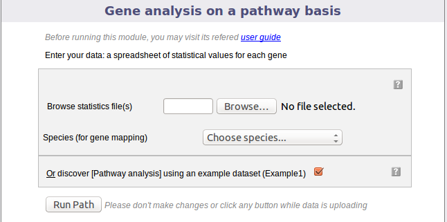
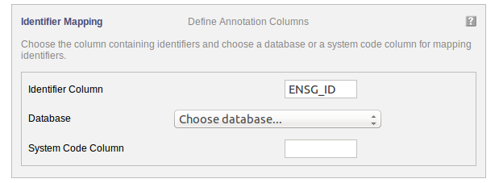
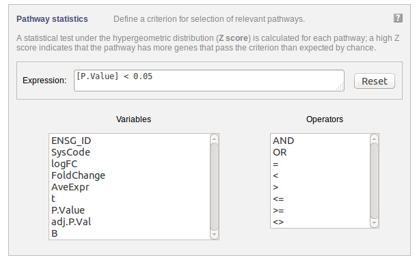
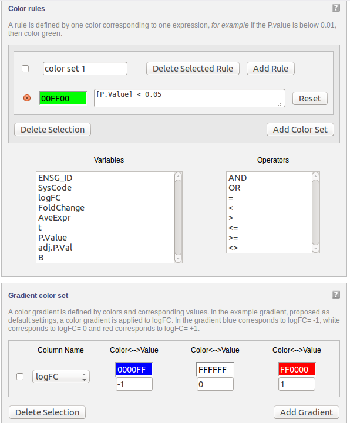
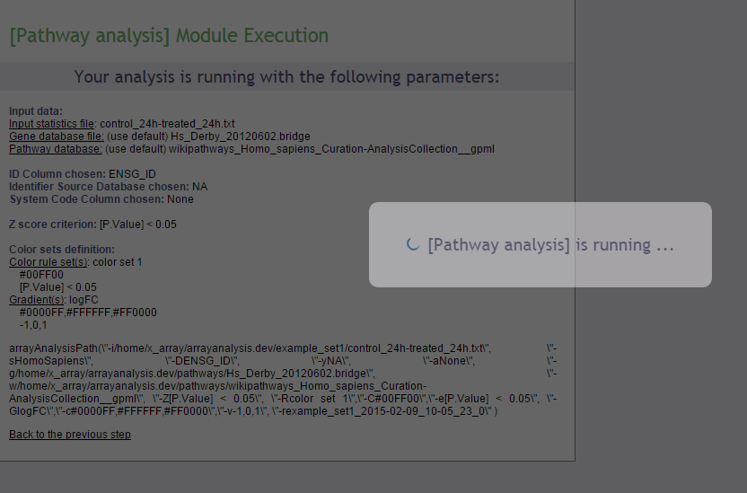
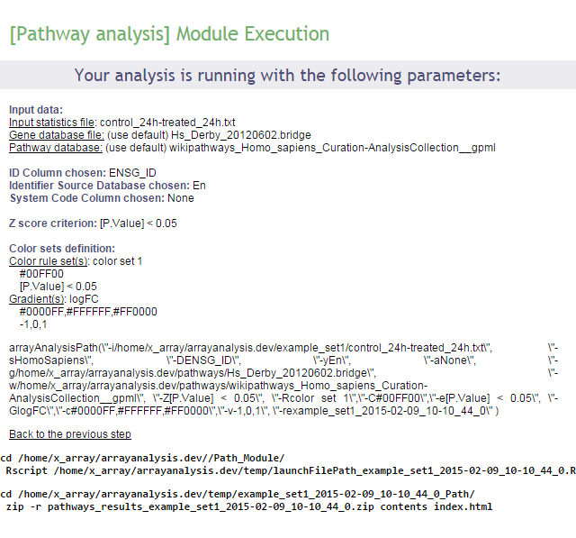
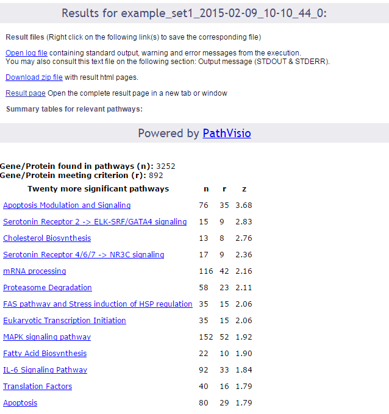
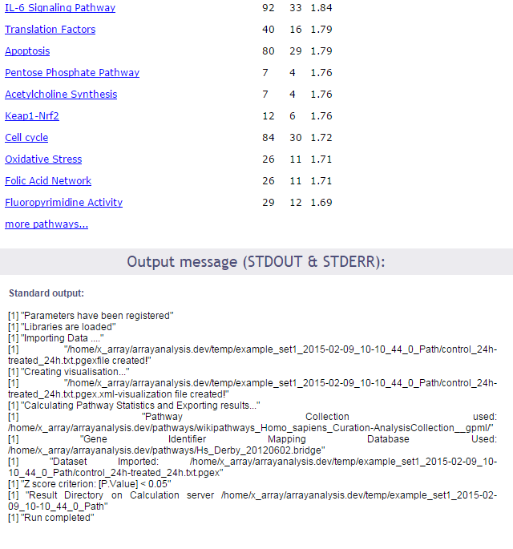
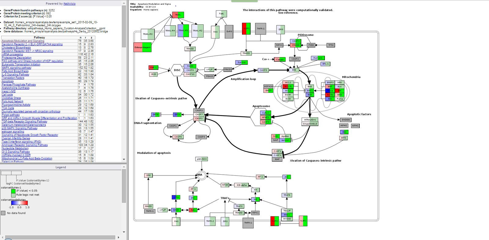

# How to use the Pathway module of ArrayAnalysis.org for pathway analysis of microarray data

* RELEASE DATE: 31.5.2016
* VERSION: V.1.0.
* MAIN AUTHOR: Friederike Ehrhart                                                                       
* AUTHORS: Lars Eijssen, Anwesha Bohler, Linda Rieswijk, Egon Willighagen, Penny Nymark
* LICENSE: Creative Commons Attribution (CC-BY) 4.0

## Introduction
PathVisio and ArrayAnalysis.org are open source, free to use online platforms for analysis of microarray data - and an alternative program for Chipster. This tutorial shows how to use the Path module (Pathway module, PathVisio webtool) of ArrayAnalysis which is designed for doing pathway analysis on microarray data. All source code has been written in R and is available at [https://github.com/BiGCAT-UM/Path_Module](https://github.com/BiGCAT-UM/Path_Module).

This technical documentation has two main objectives:
* to guide you in the use of the Path module
* to give interpretative help on the outputs of the module

The Path module can be run :
* on-line via the [http://www.arrayanalysis.org](http://www.arrayanalysis.org) webportal (follow "Get started" and choose "Pathway analysis")
* or as an automated R workflow from a local computer

The main functions of the Path module are:
* to import a dataset;
* to create a visualization;
* to calculate z-scores based on the criterion;
* to return a list of pathways sorted on the basis of z-scores.

How to use the documentation: As shown in the Table Of Contents, you will find the separate sections :
* Using the on-line Path module
* Interpreting the results provided.

Bug tracking system: If you encounter an issue by using the code, you can report it at any moment on our internal tracking system: [http://trac.bigcat.unimaas.nl/arrayanalysis/newticket](http://trac.bigcat.unimaas.nl/arrayanalysis/newticket). You can also use this system to post comments or feature suggestions.

Example gene level statistics file: An example dataset is available. When running the module, you can check a box to use this data set (Example1) in order the explore the functionality of the module.

## Application Details
You can access the on-line module on [http://www.arrayanalysis.org](http://www.arrayanalysis.org) webportal: (follow "Get started" and choose "Statistical analysis"). You don't need to log in; you just need to prepare a gene level statistics file containing the statistical contrasts between the different groups of your Affymetrix .CEL files (you may also obtain the file by running the statistical analysis module).

The on-line module contains four steps before the launch of the analysis:
* Step1: First you load the gene level statistics file and select species. Alternatively, you might select the Example dataset for exploring the module. In that case you do not need to select the species. The dataset used is for Human. Click on Run Path, to proceed.
* Step2: Choose the column in the data file containing the identifiers and the database used for annotation if all the idenitifers are from the same database. If different identifier systems are used for annotating the dataset, the system code column has to be chosen. The system code specifies which database each idenitifier belongs to.
* Step3: Specify a criterion for calculating the z-scores.
* Step4: Select color criteria for visualization of the uploaded data on the pathways.
Then:
* Execution: The module is executed with the settings you choose
* Results: You get the results after the execution step, at the website or by e-mail.

### First step: load the data file and select species

The following picture shows the screen for the first step:

This dialog allows you to upload a tab-delimited text file with (gene level statistics) data and choose the relevant species. Alternatively, the module can be run with an example data set, by ticking the checkbox presented. The interrogation mark button will give you contextual help.

### Second step: Identifier Mapping
	
The following part of the online form is used for the second step:

Your dataset has been uploaded. For mapping the uploaded data to the pathways, the annotation information needs to be filled in.

"Identifier Column" Choose the column in the uploaded data file containing the identifiers used for annotation.

"Database" If the identifiers used for annotation are all from the same database, then select the database.

OR "System Code" If identifiers from different databases are used for annotation then the a column containing the system code of the databse needs to be selected.

The interrogation mark button will give you contextual help.

### Third step: Set criterion for z-score calculation
	
The following part of the online form is used for the third step:

Select a criterion for calculating the z-score. You could, e.g. specify a criterion based on a fold change threshold. You can either type the expression in the "Expression" field or you can use the available parameters and operators listed by clicking on them.

### Fourth step: Creating a visualization
	
The following part of the online form is used for the fourth step:

Data can be visualized on pathways using colours. A gradient colouring scheme can be used to visualize a range of data on a gene (e.g. fold change) while a rule can be applied for certain criteria allowing only the genes which qualify to be coloured (e.g. P Value "<" 0.05)

### Execution
After clicking 'Run' the module is executed.

### Results
Upon completion a page of results is displayed on your screen.

In the first part of the screen, your settings are recalled. Then links to the log file of the run and to the zip file containing all results (index file, pathway images, and related backpages) are presented. The results will be described in the next section of this documentation.

### Interpret the results of the Path module

The output consists of :
An index file in html format, which contains: 		
* The number of genes/proteins in the dat aset found in the pathways of the pathway collection.
* The number of genes/proteins out of the above that meet the user defined criterion for z-score calculation.
* The criterio used for z-score calculation.
* The dataset used.
* The pathway directory used.
* The identifier mapping database used.
* A clickable list of all the pathways on which the genes of interest have been visualized sorted on the basis of z-scores.
* The file also contains the legend to better understand the visualization.
A contents folder: contains the backpages for all the pathways containing gene expression information, the legend file, the statistics file and all the colour coded pathway images.

WikiPathways provides a portal for nanomaterial relevant pathway information:
[http://www.wikipathways.org/index.php/Portal:Nanomaterials](http://www.wikipathways.org/index.php/Portal:Nanomaterials)  

