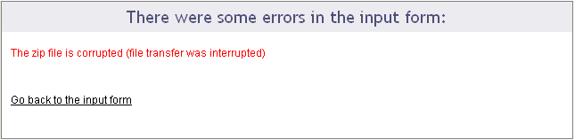

# How to use the AffyQC web tool of ArrayAnalysis.org for quality control and pre-processing of Affymetrix microarray data

* RELEASE DATE: 23.5.2016
* VERSION: V.1.0.
* MAIN AUTHOR: Friederike Ehrhart                                                                     
* AUTHORS: Lars Eijssen, Anwesha Bohler, Linda Rieswijk, Egon Willighagen, Penny Nymark
* LICENSE: Creative Commons Attribution (CC-BY) 4.0

## 1. INTRODUCTION

[ArrayAnalysis.org](http://www.arrayanalysis.org/) is an open source, free to use online platform for analysis of microarray data - and an alternative program for [Chipster](https://chipster.csc.fi/manual/supported-chips.html) (tutorial also available). ArrayAnalysis is a webtool, so there is no need for download or access code, and it provides more extensive quality control than Chipster but it is limited to two microarray formats: Affymetrix and Illumina. The exact microarray type (e.g. Affy-1) is automatically recognised. This tutorial shows how to use the Affymetrix quality control (affyQC) module which is designed for doing quality control and preprocessing of microarray data from Affymetrix microchips. All source code has been written in R and is open-source, available under the [Apache License version 2.0](http://www.apache.org/licenses/LICENSE-2.0). It is available on our [Download](http://www.arrayanalysis.org/download.php) page.

affyQC can be run :
* on-line via the [arrayanalysis.org webportal](http://www.arrayanalysis.org/) (follow ["Get started"](http://www.arrayanalysis.org/getStarted.php)).
* locally as an automated R workflow provided via a wrapper function
The main functions of affyQC are:
* to compute array quality information;
* to plot images that allow identifying any aberrations present in the dataset;
* to return pre-processed data and QC reports.
Bug tracking system: If you encounter an issue by using the code, you can report it at any moment by [email](http://www.arrayanalysis.org/affyQC/doc_affyQC_web.php) or, once you have your own account, using our [internal tracking system](http://trac.bigcat.unimaas.nl/arrayanalysis/report). You can also use this system to post comments or suggest features.

Example datasets: Note that three example datasets has been made available on our [Download page](http://www.arrayanalysis.org/download.php). They include:
* dataset raw .CEL files,
* description file,
* affyQC ouput files:
  * execution logfile,
  * report file (PDF),
  * zip archive with images and tables and
  * normalised data (text file)

You can access the on-line module on [arrayanalysis.org](http://www.arrayanalysis.org/) webportal: follow ["Get started"](http://www.arrayanalysis.org/getStarted.php) .

JavaScript has to be enabled (activated) in your web browser. You will be warned if it is not the case. You can activate it at any time in the browser options (see [activatejavascript.org](http://activatejavascript.org/en/instructions) if needed)

You don't need to log in; you just need to prepare a zipped file containing all your Affymetrix .CEL files and possibly a file describing your dataset, called the description file. A presentation of this description file is available in the fourth section, subsection ["Parameter description"](http://www.arrayanalysis.org/documentation.php). The on-line module contains three steps before the launch of the analysis:
* Step1: First you load the archive of .CEL files
* Step2: Then you complete the description of the dataset
* Step3: And finally you choose the plots to be computed and their parameters.

Then:
* Execution: The module is executed with the settings you choose
* Results: You get the results after the execution step, or by e-mail.

## APPLICATION DETAILS

### First step: load the CEL files

The following picture shows the screen for the first step:

The interrogation mark button will help you by giving you a contextual help. Note that this feature is available when Javascript is activated and is not yet supported by GoogleChrome and Safari browsers. 

Loading the zip file may take a while as CEL files are heavy; don't click any button after clicking on the "Next" button otherwise the loading of the file may be compromised. When the file is loaded without error, you are automatically directed to the next step. Otherwise you get a message indicating the error encountred:

### Second step: describe the dataset

The following picture shows the screen obtained after completing the first step:

The interrogation mark buttons will help you by giving you a contextual help. Your dataset has been read and the following information is presented in a three columns table:

Column "ArrayDataFile" contains the .CEL file names of your N arrays found in the input zip file. You cannot edit this column.

Column "SourceName" is filled with Array1 .. ArrayN. These names will be used for the analyses. Feel free to modify these names at the condition you use only unique names.

Column "FactorValue" is always set to "Group1". If you want your array groups to be represented in the analyses and plots, rename the factor groups.

You may also prefer to enter directly this information from a file you have prepared. If this is the case, browse your description file in the second section. If you enter such a file the information contained in the previous table will be skipped. You'll find a presentation of the description file on the fourth section of this documentation: "Parameter description".

The last section of the second step form proposes you to reorder the arrays per groups, which is done by default.Thus all the arrays representing the same factor will be grouped together on the plots. If you untick the checkbox, arrays will be ordered as they were in the zip file.

Clicking on the "Next" button will direct to the last step if no error has been detected.

### Third step: define your analysis

The contextual help is not any more given by the interrogation mark buttons: help messages will pop up as soon as you activate a field (for example if you click in a text field or tick a checkbox).

This last input form is divided into three main sections: the first part allows a quick launch, the second part defines in details the analysis parameters applied to the raw data and the last part is dedicated to the pre-processing (parameters for the normalization and re-annotaion) and its evaluation (definition of the analysis parameters applied to the normalized data).

First part of the input form

The following picture presents the first part; it recalls briefly what your dataset contains and asks you to enter an e-mail. This is optional: if you don't enter your e-mail, you will need to keep the browser opened and not close the page before the end of the calculation. On the contrary, if you enter your e-mail address - which is recommended - you can close the windows as soon as the next page appears and you will be inform of the end of the analysis by e-mail. You would just have to follow the links to the result files given in the e-mail.

You may launch the analysis with the "Run" button right after this first section. In this case default parameters will be used.

Note that if the species was not deduced from the previous step, you will need to fill this field first, or to untick the "Custom annotation" checkbox.

Second part of the input form

This part contains four frames representing the four families of analysis applied to your raw data: 1) Sample quality, 2) Hybridization and overall signal quality 3) Signal comparability and bias diagnostic and 4) Array correlation.

Most of the parameters are checkboxes that you would tick or untick to indicate whether a certain plot or table has to be computed or not. The analyses and plots are described in the [module description](http://www.arrayanalysis.org/affyQC/moduleDesc_affyQC.php) page, which is reachable also from the left vertical menu (we recommend you to open the pages in a new tab to not lose the information entered in the input form you are filling).

Some analyses or plot contruction, such as the MA-plot and the hierachical clustering, need paraticular parameters. You may modify the default values.

The following picture presents you this part of the input form, which defines the graphs built from the raw data:

You may note that all the plots are not selected by default; you may select all of them with the first checkbox: [toogle select all].

You may also note that some plots cannot be selected, such as the "Sample prep controls", the "Background intensity" or the "Scale factors". This is because the dataset used for this example (public dataset available on ArrayExpress: [E-GEOD-13278](https://www.ebi.ac.uk/arrayexpress/experiments/E-GEOD-13278/)), was built with PM-only arrays and the construction of these particular graphs uses the [MAS5 algorithm](http://tools.thermofisher.com/content/sfs/brochures/sadd_whitepaper.pdf) which cannot be applied to PM-only arrays.

Be aware that the generation of 2D PLM-based images for spatial biases are highly time-consuming; the generation of the complete set of images (4 different images representing the raw data, the PLM weights, residuals and residual signs) is not computed by default. See examples of these images on the [description page](http://www.arrayanalysis.org/affyQC/moduleDesc_affyQC.php) or on [Bolstad PLM](http://plmimagegallery.bmbolstad.com/) page.

Third part of the input form

The following picture presents the part of the input form concerning the pre-processing step and its evaluation:

Use the "Normalization method" drop-down menu to define the pre-processing step. You may chose "none" and keep the raw data. In this case, further parameters will be skipped. By default, the GC-RMA is applied to arrays containing both PM and MM probes and RMA is applied to PM-only arrays.

If the species could have been deduced from the CEL files in the previous steps, the "Species" field is already filled, as shown in this example. Otherwise, you would need to fill this field yourself or to untick the "Custom annotation" checkbox.

Indeed, the probesets will be re-annotated by default, using one of the gene annotation databases (see "Annotation type" drop-down menu) and the "Species" is required for the re-annotation.

After defining the pre-processing, you chose the analyses you want to apply to the normalized data. Only six graphs are proposed (other graphs are not meaningful on normalized data) and 
the parameters entered for the MA-plot and hierachical clustering applied on raw data will be also used for the normalized data.

Once the input form is completely filled, you can launch the analysis with the "Run" button. Don't click any button after clicking on the "Run" button and before being automatically redirected to the excecution page, otherwise you may compromise your analysis.

### Excecution step

After the third step, affyQC has all it needs to launch the analysis. The page become grey with a message telling you that the analysis is running. If you entered your e-mail address in the previous step, you can now close the window.

You will find on this page a recalling of the choices you made for this analysis: which files were loaded or created, which plots you decided to create for raw and normalized data and how you managed the pre-processing step.

The following picture shows the screen for the execution step:

### Getting the results

If you entered your e-mail address during the third step, you will receive an e-mail such as the one presented on the following picture:

The e-mail contains direct links to the log file, PDF report, ZIP file containing the resulting files (png images, usable for your presentations, and result files such as the PMA table) and normalized dataset (presented as a tab-delimited file). If you closed the browser once you analysis was launched, you can only reach these result files through the links given in the e-mail. You cannot access your results from the arrayanalysis.org portal anymore.

On the contrary, if you did not close the browser, the result page presented in the following pictures shows up when the calculation are ended.

A first section gives you the same links to the result files than the e-mail: we recommend you either to save these links or to save the result files because if you did not enter your e-mail, once you close this result page, you will not be able to reach them again.

You can download your result files during one week from the links given by e-mail or by the result page. Make sure you download the files before this period elapses.

This section ends with a frame in which the PDF report is opened. You can visualize the document and save it from this frame. 

A second section of the result page shows the log file content. This information is important when you encountered a bug in the execution: you can report the bug in our [internal tracking system](http://trac.bigcat.unimaas.nl/arrayanalysis/report) or by [email](http://www.arrayanalysis.org/affyQC/doc_affyQC_web.php). If you do so, please send us the log information by:
* either saving the log file on your computer (see previous links) and attach it to the ticket/e-mail
* or copy and paste the text from the screen.

