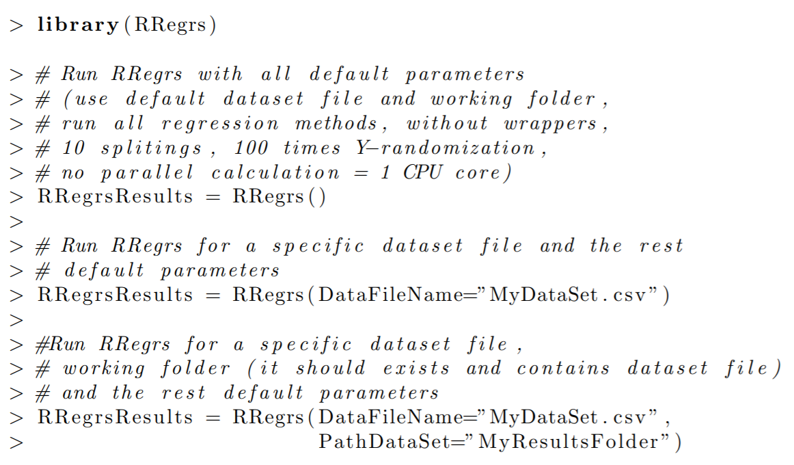

# RRegrs Package Tutorial

## 1	Introduction

RRegrs is a collection of R regression tools based on the caret package. It is used to find the best regression models for any numerical dataset. The initial use of the script is aimed at finding QSAR models for chemoinformatics / nanotoxicology for eNanoMapper European project.

## 2	Concepts

RRegrs represents a simple tool to screen any dataset for the best regression model using ten implemented regression method
1.Linear Multi-regression (L)

2.Generalized Linear Model with Stepwise Feature Selection (GL)

3.Partial Least Squares Regression (PL)

4.Lasso regressi

5.Elastic Net regression (ENE)

6.Support vector machine using radial functions (SVM radia)

7.Neural Networks regression (NN)

8.Random Forest (RF)

9.Random Forest-Recursive Feature Elimination (RF-RFE)

10.Support Vector Machines Recursive Feature Elimination (SVM-RFE)

RRegrs permits you to run all the methods by using only one function call. The main func-tion of the package (RRegrs) contains several sections: loading parameters and dataset, remove near zero variance features, scaling dataset, remove correlated features, dataset splitting, run the 10 regression methods, summary of statistics for all methods and splittings, averages for each method and cross-validation type for all splittings, automatic best model statistics, best model Y-randomization. Assessment of Applicability Domain was included in each method.

In order to use RRegrs function, it is needed to specify a minimum set of parameters (the others will get default values). All the parameters will be written into a CSV file (ex: Parameters.csv), in the same working folder where it should be present the input dataset file and the outputs files.The dataset needs to have CSV format, with the first column as the dependent variable. The input and output files will be placed into a working folder. The output files are CSV statistics files, PDF and PNG plots.

The prerequisite libraries needed are data.table, corrplot, caret, kernlab, pls, randomForest,

RSNNS, doSNOW, foreach, doMC. The minimal call for the RRegrs() function could be:

```
> library(RRegrs)
```
```
> #Run RRegrs with all default parameters
> #(use default data set file and working folder,
> #run	all regression	methods,	without wrappers,
> #10	splitings,  100 times Y−randomization,
> #no	parallel calculation= 1	CPU core)
```
```
>RRegrs Results= RRegrs()
```




> #Run RRegrs for a specific data set file and the rest > #default parameters
>RRegrs Results = RRegrs(DataFileName=”MyDataSet.csv”)
>
> #Run RRegrs for a specific data set file ,
> #working folder(it should exist and contains data set file)
> # and the rest default parameters
>RRegrs Results= RRegrs(DataFileName=”MyDataSet.csv”,
>                       PathDataSet=”MyResultsFolder”)
The default values could be found into the RRegrs definition:

The calculations need to be done using a specific folder where all the input, output files can be found. RRegrs main function is using an extended set of parameters* 
* DataFileName: Input dataset file name (default
* PathDataSet: Working folder for all input and output file
* noCores: number of CPU cores to be used for calculation - 0=all available, 1=no parallel, n = specific number of cores; depending on operating system, di↵erent R package will be needed: doMC for Linux or Mac, doSNOW and foreach for Windows; on Windows, using RStudio, several processes will be created and if all the available cores will be used, the computer will become very slow (it is indicated the use of available cores-1 and the restart of RStudio to free the RAM between calculations
* ResAvgs: Output file name for averaged statistics (by splittings) for each regression metho
* ResBySplits: Output file name statistics for each splitting and each regression method (main statistics for all calculations
* ResBest: Output file name statistics for the best mode
* fDet: If print details for all the functions (default = TRUE
* fScaling: If Scalling datase
* fFilters: if run custom filter (not implemented yet!
* fRemNear0Var: If run Removal of near zero variance column
* fRemCorr: If run Removal of correlated column
* fLM : If run LM
* fGLM : If run GLM
* fPLS : If run PLS
* fLASSO: If run Lasso
* fENET : If run ENET
* fSVRM : If run SVM radial
* fNN : If run NN
* fRF : If run RF
* fSVMRFE : If run SVM-RFE
* RFE SVM C : Values of C for SVM-RFE
* RFE SVM epsilon: Values of epsilon for SVM-RFE
* cutoff : Cutoff for correlated features (default = 0 .9)
* iScalCol: Type of scaling: 1 = normalization; 2 = standardization; 3 = other; any other: no scaling
* iScalCol: Scaling columns : 1 = including dependent variable; 2: only all the features
* trainFrac: Fraction of training set from the entire dataset (default = 0.75); the rest of dataset is the test
* iSplitTimes: Number of splittings the dataset into train and test (default =
* noYrand: Number of Y-Randomization (default = 100* 
* CVtypes: Cross-validation types: 10-CV (repeatedcv), LOOCV, etc. form caret package (see note below)
* No0NearVarFile: Dataset file name without zero near features (if details is chosen)
* ScaledFile: Scaled dataset file name (if details is chosen)
* * NoCorrFile: Dataset file name after correlation removal (if details is chosen)
* lmFile: LM output file name with details
* glmFile: GLM output file name with details
* plsFile: PLS output file name with de
* lassoFile: Lasso output file name with details
* svrmFile: SVM Radial output file name with det
* nnFile: NN output file name with det
* rfFile: RF output file name with det
* rfrefFile: RFREF output file name with det
* svmrfeFile: SVMRFE output file name with det
* enetFile: ENET output file name with det
* fR2rule: If true, R2 rule will be used to select the best model (else ad
Even if RRegrs will create outputs files with all statistics and plots, the function return a list with model’s statistics and the the full regression model (resulted from caret traini
Each regression funct
* Uses caret package functions such as train function to train the model and trainControl to set the training conditions (10 repetitions, RMSE used as metrics to choose the mo* •Generates the same list of statistics with 17 values: regression name, split number, cross-validation type, number of model features, names of model features, training adjusted R-squared, training root mean squared error (RMSE), training R-squared, training stan-dardized RMSE, test adjusted R-square, test RMSE, test R-squared, test correlation, both (training and test) adjusted R-squared, both RMSE, and both R-squa
* If details are needed, several output files are genera
– a CSV file with detailed statistics about the regression mo
  * Regression method, splitting number, cross-validation type Training set summary
  * Test set summary
  * Fitting summary 
  * List of predictors
  * Training predictors
  * Test predictors
  * Full statistics = the list of 17 values defined above
  * Feature importance
  * Residuals of the fitted m
  * Assessment of applicability domain / leverage analysis (if the determinant is not zero): mean of hat values, hat values with warnings (X3 and X2 for values 3 and 2 times than hat mean), leverage threshold, list of points with leverage greater than threshold, Cook’s distance cutoff, Cook’s distances, points influ
– 5 − 12 plots for fitting statistics as a PDF file for each splitting and cross-validation me
  * Training Yobs-Ypred 
  * Test Yobs-Ypred
  * Feature Importance
  * Fitted vs. Residuals for Fitted Model
  * Leverage for Fitted Model
  * Cook’s Distance for Fitted Model
  * 6 standard fitting plots using plot function with cutoff.
The outputs can differ depending on the regression method u
After filtering the dataset for correlated variables, near-zero variance features and splitting the dataset into training and test sets, the user’s selected regression methods will be executed for each splitting and cross-validation type. Some of the complex regression methods (RF, SVM-RFE, RF-RFE) are using only 10-fold cross-validation (other validation methods could be very slow for these complex functions). The parallel support for calculations is presented only for the complex functi
In the next step, a CSV output file will be created with all the basic statistics (17 values) for each method type, splitting and cross-validation type. These summary statistics are used to generate another CSV file with the averaged statistics by all splittings, for each regression method and cross-validation type. The best regression model is chosen based on the following criteria: from the best test R-squared (+/- 0.05), the model with minimum RMSE is the final one. If fR2rule is False, adjR2 will be used to select the best model. For the best model, an additional CSV file is generated containing detailed statistics as well as PDF plots for important statist
Please note that the Cross-validation types available are the resampling methods available from trainControl caret and rfeControl ca
* when no feature selection is requested: boot, boot632, cv, repeatedcv, LOOCV, LGOCV, none, oob, adaptive cv, adaptive boot or adaptive LG
* when feature selection is requested: boot, cv, LOOCV or LG
* when a mixture of methods is requested (feature and non feature selection), options from the second list should be selec
If the wrapper function are selected, SVMRFEreg and RFRFEreg functions could be used. The following section is presenting the code flow with details about the data objects, i
and output files, and functions used into the main RRegrs funct
3	RRegrs function code 
This section presents datails about variable names, input and output files, order of the secti
1.Load parameters and dat
* Load Parameters from the function call as data frame: Param
* Write all parameters into a CSV file (default: Parameters.
2.Remove the NA v* 
3.Remove near zero variance columns using RemNear0VarCols = ds - No0Var
4.Scaling dataset (normalization - default, standardization, etc.) using ScalingDS = ds - Sc
5.Remove correlated features using RemCorrs 
* Dataset without correlated features: Scaled NoCorrs
* Correlation matrix: Scaled NoCorrs CorrMAT
* Correlation plot before removal of features: Scaled NoCorrs Corrs
6.Dataset splitting: Training and Test sets using DsSplit = ds.train, ds.test - CSVs for train and test; for each dataset splitting (default = 10) repeat steps 7 − 9 = dfMod
7.Regression Met
* Executed for each cross-validation type (non-wrapper or wrap
* Resulted PDF plots for each method, split and cross-validation 
* Resulted CSV files for each method with detailed statis
* Each method return a list containing: statistics values and the fitter model obtained with caret pac
* All models are memorized into variable d
(a)Basic LM using LMreg ! lm.model appended to d
(b)GLM based on AIC regression using GLMreg ! glm.model appended to d
(c)PLS using PLSreg ! pls.model appended to d
(d)Lasso using LASSOreg ! lasso.model appended to d
(e)Elastic Nets ENETreg ! enet.model appended to d
(f)SVM radial regression using SVLMreg ! SVRM.model appended to d
(g)Neural Networks Regression using NNreg ! nn.model appended to d
(h)Random Forest Regression RFreg ! rf.model appended to d
(i)Random Forest-Recursive Feature Elimination (RF-
(j)Support Vector Machines Recursive Feature Elimination SVMRFEreg ! svmrfe.model appended to d
8.Fitted models comparison pl
Models are compared in terms of their resampling results. The resamples() caret func
is used to collect, summarize and contrast the resampling results. Plots are produced per training set (i.e. per data split), and for di↵erent estimated R2 and RMSE values, e.g. ’DifModels.RMSE.iSplits.1.pdf’, ’DifModels.R2.iSplits.1.pdf’. Note that only models with the same resampling scheme are compa
9.Res
* All statistics results (not ordered) = df.res - RRegrsResBySplit
* Averaged statistics of the results by each Regression Method and CV 
* All results as data table - dt
* Averaged results = dt.
* Ordered averaged results = dt.mean.ord - RRegsResAvgs
10.Best model selection – max R2.ts (+/ − 0.005), min 
* Max R2.ts = Best model statistics - bes
* R2.ts for the best model = best.R2
* Add new conditions (max adjR2.ts (+/ − 0.005), min RMSE) = bes
* Regression method for the best model = best
11.Best model detailed statis
* Detailed statistics for the best model = RRegrsResBest
* Run the caret function with the method from the best method = my.stats
* Plots for best model with 10-fold CV and last split: RRegrsResBest.csv.repeatedcv.split2
* Regression method for the best model = best
12.Y-randomization for best model – default = 100 t
* Using Yrandom = R2Di↵.Yrand - RRegrsResBest.csv.Yrand.Hist
4	Resampling met
Model performance is estimated using resampling techniques, namely k-fold cross-validation (CV), leave-one-out (LOO) CV, bootstrapping. Particularly, repeated data splitting is performed (de-fault value 10), whereas during the procedure of building the model a set of modified data sets are created from the training samples based on the options o↵ered by train() and rfe() functions in caret package- NAMES in RRgres. Both functions consider a grid of candidate tunning param-eters, and the final tunning parameter set is chosen based on aggegating resampling performance estimates for each of the hold-out sample set. These performance estimates are used to evaluate which combination(s) of the tuning parameters are appropriate. Once the final tuning values are assigned, the final model is refit using the entire training set. Finally the performance of the model is evaluated on the test set.

By default the root mean square error (RMSE) is used to calculate performance but R2 and adjusted-R2 options are also availab
5	RRegrs package functions

5.1	RRegrs funct
RRegrs is the main function of the current package and it permits to execute all regression methods for any dataset in only one ca
RRegrs function is based on 11 regression methods that use caret package. The following subsections will present the regression methods which can also be used individually. In order to do that we need to specify all parameters and the data set used, by either defining the parameters file as we have done before:

> #  f l a g	t o	c a l c u l a t e	and	p r i n t	d e t a i l s	f o r	a l l	t h e	f u n c t i o n s

>f D e t <− as . l o g i c a l (

>Param . df [ which ( Param . df$RRegrs . Parameters==” f D e t ” ) , 2 ]

>)

>

> # t o  r e a p e a t  t h e  d s	s p l i t t i n g ,	d i f f e r e n t	v a l u e s	o f	s e e d	w i l l	b e	u s e d

>i S e e d <− i

>

>

> # t h e f r a c t i o n o f t r a i n i n g s e t from t h e e n t i r e d a t a s e t ; > # t r a i n F r a c = t h e r e s t o f d a t a s e t , t h e t e s t s e t > t r a i n F r a c <− as . numeric (


7


>as . character (

>Param . df [ which ( Param . df$RRegrs . P a r a m e t e r s==” t r a i n F r a c ” ) , 2 ]

>)

>)

>

> #  d a t a s e t  f o l d e r  f o r  i n p u t  and  o u t p u t  f i l e s

>PathDataSet <− as . character (

>Param . df [ which ( Param . df$RRegrs . Pa r am e t e r s==” PathDataSet ” ) , 2 ]

>)

>

> # i n p u t  s t e p  1 = d s  o r i g i n a l  f i l e  name

>DataFileName<− as . character (

>Param . df [ which ( Param . df$RRegrs . Pa r am e t e r s==” DataFileName ” ) , 2 ]

>)

>


> # G ener ate
p a t h +  f i l e  name =  o r i g i n a l  d a t a s e t

> i n F i l e <− f i l e . path ( PathDataSet ,
DataFileName )

>


> #s c a l e d  d s
f i l e  name  ( i n  t h e  same
f o l d e r )

> S c a l e d F i l e
= as . character (


>Param . df [ which ( Param . df$RRegrs . Pa r am e t e r s==” S c a l e d F i l e ” ) , 2 ]

>)

>

>ds <− read . csv ( i n F i l e , h e a d e r=T)

>
> # r e t u r n  a  l i s t  w i t h  2  d a t a s e t s  =  d s L i s t $ t r a i n ,  d s L i s t $ t e s t

> d s L i s t  <− D s S p l i t ( ds , t r a i n F r a c , fDet , PathDataSet , i S e e d )
>

> # g e t  t r a i n  and  t e s t  from  t h e  r e s u l t e d  l i s t

>ds . t r a i n<− d s L i s t $ t r a i n

> ds . t e s t <− d s L i s t $ t e s t
>

> # t y p e s  o f  c r o s s −v a l i d a t i o n  methods

> CVtypes <− s t r s p l i t ( as . character (
>Param . df [ which ( Param . df$RRegrs . Pa r am e t e r s==” CVtypes ” ) , 2 ] ) , ” ; ”

>) [ [ 1 ] ]

Or by individually defining all parameters:

> #  f l a g  t o  c a l c u l a t e  and  p r i n t  d e t a i l s  f o r  a l l  t h e  f u n c t i o n s

>f D e t <− FALSE

>

> # t o  r e a p e a t  t h e  d s  s p l i t t i n g ,  d i f f e r e n t  v a l u e s  o f  s e e d  w i l l  b e  u s e d

>i S e e d <− i

>
> # t h e  f r a c t i o n  o f  t r a i n i n g  s e t  from  t h e  e n t i r e  d a t a s e t ;

> t r a i n F r a c <− 0 . 7 5
>

>

> #  d a t a s e t  f o l d e r  f o r  i n p u t  and  o u t p u t  f i l e s

>PathDataSet <− ’ D a t a R e s u l t s ’

>
> # u p l o a d  d a t a  s e t

>ds <− read . csv ( ds . Housing , h e a d e r=T)# ! ! ! !

>


> # r e t u r n  a  l i s t  w i t h  2  d a t a s e t s  =  d s L i s t $ t r a i n ,  d s L i s t $ t e s t

> d s L i s t  <− D s S p l i t ( ds , t r a i n F r a c , fDet , PathDataSet , i S e e d )
>

> # g e t  t r a i n  and  t e s t  from  t h e  r e s u l t e d  l i s t

>ds . t r a i n<− d s L i s t $ t r a i n

> ds . t e s t <− d s L i s t $ t e s t
>

> # t y p e s  o f  c r o s s −v a l i d a t i o n  methods

>CVtypes <− c ( ’ r e p e a t e d c v ’ , ’LOOCV ’ )

For this particular example we are looking at the Boston Housing data [1].

5.2	Basic Linear regression (LM) function

LM is called via train() caret function having no extra tuning parameters. RMSE was chosen as the summary metric used to select the optimal model. trainControl() caret function is used to set the resampling method used and its parameters, namely for the k-fold CV we set k=10, and the default value is to repeat the resampling procedure 10 times.

> # d e f i n e t h e o u t p u t f i l e where a l l r e s u l t s (CSV, PDF f i l e s ) > # w i l l be s t o r e d

>outLM <− ’ LMoutput . c s v ’

>LM. f i t <− LMreg (

>ds . t r a i n , ds . t e s t , CVtypes [ 1 ] , i S p l i t =1, f D e t=F , o u t F i l e=outLM

>)

If the details are used, the function is creating several output files such as a CSV file with all calculation details and PDF files for each cross-validation type and split.

5.3	Generalized Linear Model with Stepwise Feature Selection (GLM) function

GLM is called via train() caret function using the glmStepAIC function from the MASS package. No tuning parameters are set. RMSE was chosen as the summary metric used to select the optimal model. trainControl() caret function is used to set the resampling method used and its parameters, namely for the k-fold CV we set k=10, and the default value is to repeat the resampling procedure 10 times.

> # d e f i n e t h e o u t p u t f i l e where a l l r e s u l t s (CSV, PDF f i l e s ) > # w i l l be s t o r e d

>outGLM<− ’ GLMoutput . c s v ’

>GLM. f i t <− GLMreg(

>ds . t r a i n , ds . t e s t , CVtype [ 1 ] , i S p l i t =1 , f D e t=F , o u t F i l e=outGLM

>)

If the details are used, the function is creating several output files such as a CSV file with all calculation details and PDF files for each cross-validation type and split.

5.4	Partial Least Squares Regression (PLS) function

PLS is called via train() caret function using the mvr function of the pls package. RMSE was chosen as the summary metric used to select the optimal model. The number of components is the tuning parameter of the model, which we set to a sequence of integers from 1 to one fifth of the number of features in the training data set. (If the later is smaller than 1, tuning parameter is set to 1.)

trainControl() caret function is used to set the resampling method used and its parameters, namely for the k-fold CV we set k=10, and the default value is to repeat the resampling procedure 10 times.

> # d e f i n e t h e o u t p u t f i l e where a l l r e s u l t s (CSV, PDF f i l e s ) > # w i l l b e s t o r e d

>outPLS<− ’ PLSoutput . c s v ’

>PLS . f i t <− PLSreg (

>ds . t r a i n , ds . t e s t , CVtype [ 1 ] , i S p l i t =1 , f D e t=F , o u t F i l e=outPLS

>)

If the details are used, both functions are creating several output files such as a CSV file with all calculation details and PDF files for each cross-validation type and split.

5.5	Lasso regression function

Lasso is called via train() caret function using the enet function of the elasticnet package. RMSE was chosen as the summary metric used to select the optimal model. Fraction is the tuning parameter of the model which is the ratio of the L1 norm of the coefficient vector, relative to the norm at the full LS solution. We have set fraction to vary in a sequence of 10 values between zero and one.

trainControl() caret function is used to set the resampling method used and its parameters, namely for the k-fold CV we set k=10, and the default value is to repeat the resampling procedure 10 times.

> # d e f i n e t h e o u t p u t f i l e where a l l r e s u l t s (CSV, PDF f i l e s ) > # w i l l b e s t o r e d

>outLASSO<− ’ LASSOoutput . c s v ’

>LASSO . f i t <− LASSOreg (

>ds . t r a i n , ds . t e s t , CVtype [ 1 ] , i S p l i t =1 , f D e t=F , o u t F i l e=outLASSO

>)

Following the guidelines by the elasticnet package, LASSOreg only runs for k-fold CV schemes.

If the details are used, the function is creating several output files such as a CSV file with all calculation details and PDF files for each cross-validation type and split.

5.6	Elastic Net regression (ENET) function

Elastic net from glmnet package have mainly two parameters, alpha and lambda. Instead of using the standard caret package sCV parameterization, the proper alpha value is chosen by sCV (alpha =1 lasso, alpha =0 ridge), and labda is chosen using the glmnet package. RMSE was chosen as the summary metric used to select the optimal model.

trainControl() caret function is used to set the resampling method used and its parameters, namely for the k-fold CV we set k=10, and the default value is to repeat the resampling procedure 10 times.

sCV can take the following values: boot, boot632, cv, repeatedcv, LOOCV, LGOCV (for repeated training/test splits), none (only fits one model to the entire training set), oob (only for random forest, bagged trees, bagged earth, bagged flexible discriminant analysis, or conditional tree forest models), adaptive cv, adaptive boot or adaptive LGOCV.


> # d e f i n e t h e o u t p u t f i l e where a l l r e s u l t s (CSV, PDF f i l e s ) > # w i l l b e s t o r e d

>outENET<− ’ ENEToutput . c s v ’

> ENET. f i t <− ENETreg (my . d a t f . t r a i n , my . d a t f . t e s t , sCV , i S p l i t 1 , f D e t=F , o u t F i l e=outENET)


If the details are used, the function is creating several output files such as a CSV file with all calculation details and PDF files for each cross-validation type and split.

5.7	Support vector machine using radial functions (SVM radial) regres-sion function

SVM radial is called via train() caret function using the ksvm function of the kernlab package (the kernel function used is ’rbfdot’ Radial Basis Gaussian kernel). RMSE was chosen as the summary metric used to select the optimal model. Tuning parameters in this case are sigma (inverse kernel width) and a regularization parameter C cost (controls how much the regression line can adapt to the data smaller values result in more linear, i.e. flat surfaces.). We have set sigma to be estimated by sigest from kernlab package, and C to vary in c(1,5,10,15,20).

trainControl() caret function is used to set the resampling method used and its parameters, namely for the k-fold CV we set k=10, and the default value is to repeat the resampling procedure 10 times.

> # d e f i n e t h e o u t p u t f i l e where a l l r e s u l t s (CSV, PDF f i l e s ) > # w i l l b e s t o r e d

>outSVRM<− ’ SVRMoutput . c s v ’

>SVRM. f i t <− SVRMreg(

>ds . t r a i n , ds . t e s t , CVtype [ 1 ] , i S p l i t =1 , f D e t=F , o u t F i l e=outSVRM

>)

If the details are used, the function is creating several output files such as a CSV file with all calculation details and PDF files for each cross-validation type and split.

5.8	Neural Networks regression (NN) function

ANis called via train() caret function using the nnet function of the nnet package. RMSE was chosen as the summary metric used to select the optimal model. Tuning parameters in this case are size and decay, where size refers to the number of units in the hidden layer and decay to the weight decay. Size is set to vary in c(1, 5, 10, 15) and decay within a sequence of values in [0, 0.001].

trainControl() caret function is used to set the resampling method used and its parameters, namely for the k-fold CV we set k=10, and the default value is to repeat the resampling procedure 10 times.

> # d e f i n e t h e o u t p u t f i l e where a l l r e s u l t s (CSV, PDF f i l e s ) > # w i l l b e s t o r e d

>outNN<− ’ NNoutput . c s v ’

>NN. f i t <− NNreg (

>ds . t r a i n , ds . t e s t , CVtype [ 1 ] , i S p l i t =1 , f D e t=F , o u t F i l e=outNN

>)

If the details are used, the function is creating several output files such as a CSV file with all calculation details and PDF files for each cross-validation type and split.

5.9	Random Forest (RF) regression function

RF (random forest) is called via train() caret function using the randomForest function of the randomForest package. RMSE was chosen as the summary metric used to select the optimal model. Tuning parameters in this case are the number of features selected randomly for each tree in the forest. The recommended value is the square root of the total number of features, however, we recommend a set of values between this value and the total number of features. Of course, the bigger this number, the lower the algorithm. The adjustment values are TO COMPLE
trainControl() caret function is used to set the resampling method used and its parameters, namely for the k-fold CV we set k=10, and the default value is to repeat the resampling procedure 10 times. Each random forest grows 1500 trees.

During the model selection process, the sCV method try to find the best number of features automaticaly chosen in each tree of the RF. The possible values are: numberFeatures/3 (default in randomForest Package), numberFeatures and numberFeatures/2.

sCV can take the following values: boot, boot632, cv, repeatedcv, LOOCV, LGOCV (for repeated training/test splits), none (only fits one model to the entire training set), oob (only for random forest, bagged trees, bagged earth, bagged flexible discriminant analysis, or conditional tree forest models), adaptive cv, adaptive boot or adaptive LGOCV
> # d e f i n e t h e o u t p u t f i l e where a l l r e s u l t s (CSV, PDF f i l e s ) > # w i l l b e s t o r e d

>outRF <− ’ RFoutput . c s v ’

>RF . f i t <− RFreg (

>my . d a t f . t r a i n , my . d a t f . t e s t , sCV , i S p l i t 1 , f D e t=F , o u t F i l e=outRF

>)

If the details are used, the function is creating several output files such as a CSV file with all calculation details and PDF files for each cross-validation type and split.

5.10	Support Vector Machines Recursive Feature Elimination (SVM-RFE) regression function

SVM is called via eps-svr function of the kernlab package and uses the RFE function of the caret package to obtaing the best SVM model with the best feature set. RMSE was chosen as the summary metric used to select the optimal model.

trainControl() caret function is used to set the resampling method used and its parameters, namely for the k-fold CV we set k=10, and the default value is to repeat the resampling procedure 10 times.

sCV can take the following values: boot, boot632, cv, repeatedcv, LOOCV, LGOCV (for repeated training/test splits), none (only fits one model to the entire training set), oob (only for random forest, bagged trees, bagged earth, bagged flexible discriminant analysis, or conditional tree forest models), adaptive cv, adaptive boot or adaptive LGOCV.


> # d e f i n e t h e o u t p u t f i l e where a l l r e s u l t s (CSV, PDF f i l e s ) > # w i l l b e s t o r e d

>outSVMRFE<− ’ SVMRFEoutput . c s v ’

>SVMRFE. f i t <− SVMRFEreg(

>my . d a t f . t r a i n , my . d a t f . t e s t , sCV , i S p l i t 1 ,

>f D e t=F , o u t F i l e=outSVMRFE , c s=c ( 1 , 5 , 1 5 , 5 0 ) , e p s=c ( 0 . 0 1 , 0 . 1 , 0 . 3 )

>)

If the details are used, the function is creating several output files such as a CSV file with all calculation details and PDF files for each cross-validation type and split.

5.11	Random Forest-Recursive Feature Elimination (RF-RFE) regres-sion function

RF-RFE represents a wrapper version of RF and, therefore, it will be executed only of feature selection flag was choose.

RF (random forest) is called via train() caret function using the randomForest function of the randomForest package and uses the RFE function of the caret package to obtaing the best SVM model withe the best feature set. RMSE was chosen as the summary metric used to select the optimal model. Tuning parameters in this case are the number of features selected randomly for each tree in the forest. The recommended value is the square root of the total number of features, however, we recommend a set of values between this value and the total number of features. Of course, the bigger this number, the lower the algorithm. The adjustment values are TO COMPLETE

trainControl() caret function is used to set the resampling method used and its parameters, namely for the k-fold CV we set k=10, and the default value is to repeat the resampling procedure 10 times. Each random forest grows 1500 trees.

During the model selection process, the sCV method try to find the best number of features automaticaly chosen in each tree of the RF. The possible values are: numberFeatures/3 (default in randomForest Package), numberFeatures and numberFeatures/2.

sCV can take the following values: boot, boot632, cv, repeatedcv, LOOCV, LGOCV (for repeated training/test splits), none (only fits one model to the entire training set), oob (only for random forest, bagged trees, bagged earth, bagged flexible discriminant analysis, or conditional tree forest models), adaptive cv, adaptive boot or adaptive LGOCV.


> # d e f i n e t h e o u t p u t f i l e where a l l r e s u l t s (CSV, PDF f i l e s ) > # w i l l b e s t o r e d

>outRFRFE<− ’ RFRFEoutput . c s v ’

>RFRFE. f i t <− RFRFEreg (

>my . d a t f . t r a i n , my . d a t f . t e s t , sCV , i S p l i t 1 ,

>f D e t=F , o u t F i l e=outRFRFE

>)

If the details are used, the function is creating several output files such as a CSV file with all calculation details and PDF files for each cross-validation type and split.

Several function have been created in order to split the dataset, remove near-zero variance features, remove correlated features, etc. (the the code flow section).

5.12	Removal of near zero variance columns

This function is based on nearZeroVar function from caret and it has several parameters as input: ds = dataset features without predicted variable (as data frame), fDet = if details (default is FALSE), outFile = output file with modified dataset (default is ”ds3.No0Var.csv”):

> # Removal o f near z e r o v a r i a n c e columns and add t h e p r e d i c t e d v a r i a b l e > # => ds . new = new d a t a s e t ( as d a t a frame )

>ds . new <− cbind (

>” n e t . c ” = ds [ , 1 ] , RemNear0VarCols ( ds [ , 2 : dim( ds ) [ 2 ] ] , fDet , o u t F i l e )

>)

5.13	Scaling dataset

This function is based on scale function from caret and it has several parameters as input: ds = dataset features (as data frame), s = 1,2,3 - type of scaling: 1 = normalization, 2 = standard-ization, 3 = other (default = 1 = Normalization), c = the number of column into the dataset to start scaling (default = 1; if c = 1, included the dependent variable; if c = 2, only the features will be scaled), fDet = if details (default is FALSE), outFile = output file with modified dataset (default is ”ds4.scaled.csv”). If s di↵erent of 1,2,3 is used, there is no scaling.


># S c a l i n g

>ds . new <−


d a t a s e t  => ds . new = new  d a t a s e t	( as	d a t a	frame )

S c a l i n g D S ( ds , i S c a l i n g , i S c a l C o l , fDet , o u t F i l e )


5.14	Remove correlated features

This function is based on scale functions from caret and corrplot packages. It has several param-eters as input: ds = dataset frame, fDet = flag for details (TRUE/FALSE), cutoff= correlation cut o↵(ex: 0.9), outFileName = file name with the corrected dataset (it could include the path).* 
> # Remove  t h e  c o r r e l a t e d  columns => ds . new = new

> # ( as  d a t a  frame )  and  r e b u i l d  t h e  new  d a t a  frame

> # p r e d i c t e d  v a r i a b l e

> ds . new <− cbind (


d a t a s e t

w i t h	t h e

>” n e t . c ” = ds [ , 1 ] , RemCorrs ( ds [ , 2 : dim( ds ) [ 2 ] ] , fDet , c u t o f f , o u t F i l e )

>)

Additional files are generated if fDet is TRUE such as correlation matrix (CSV) and plot the correlation plot before correlation removal (PDF).

5.15	Dataset splitting in Training and Test

This function is based on createDataPartition function from caret and it has several parameters as input: ds = frame dataset object, trainFrac = training set ratio from the entire dataset (default

=3/4 = 75%), fDet = flag for detais (default = FALSE), PathDataSet = pathway for results, iSeed = number to be used as seed.


># D a t a s e t

># two  d a t a

>d s L i s t  <−


s p l i t i n g	i n	T r a i n i n g  and  T e s t => d s L i s t =  l i s t	w i t h

f r am e s	f o r	t r a i n i n g  and	t e s t

D s S p l i t ( ds , t r a i n F r a c , fDet , PathDataSet , i S e e d )


5.16	Y-randomization for the best model

It uses only one splitting, 10-cross validation (repeatedcv) and the best method. Best R2 for test (best.R2.ts) will be compared with R2 in test with Y-randomization (Yrand.R2.ts) and it returns ratios between the di↵erence of R2 and best R2 (Di↵sR2/bestR2). DsSplit is using for splitting the dataset.

The function is appending outputs to the general CSV statistics file and a histogram as PDF plot.

It is based on createDataPartition function from caret and it has several parameters as input: ds = frame dataset object, trainFrac = training set ratio from the entire dataset, best.reg = label of the method, best.r2.ts = value of R2 for the best model in test set, noYrand = number of randomization (optimal = 100), ResBetF = file name for the best model output CSV file.

> # Y−r a n d o m i z a t i o n  t e s t
> #  p a r a l l e l  s u p p o r t  u s i n g  2 CPU c o r e s

>R 2 D i f f . Yrand <− Yrandom (

>ds , t r a i n F r a c , b e s t . reg , b e s t . R2 . ts ,

>noYrand , ResBestF

>)

This function calls the best model regression method and, if it is a complex method, there is a need of parallel calculation.

5.17	Auxiliary functions

Several functions have been developed in order to print specific data types to text or CSV files or to calculate several statistics:
* r2.adj.funct = calculates adjusted R2
* r2.adj.lm.funct = calculates adjusted R2 for LM
* rmse.funct = calculates RMSE
* r2.funct = calculates R2
* AppendList2CSv = writes a list to CSV file
* AppendList2txt = writes a list to TXT file
* findResamps.funct = find the number of re-samples for caret, rfe or sbf objects from caret package
* svmFuncsW$fit = calculates the best model with the best feature set (c and epsilon)
* svmFuncsW$rank = calculates the k w2 k as ranking criterion for measuring the importance of a particular featur in the RFE process.
* svmFuncsW$pred = [to be completed]
* svmFuncsGradW$rank = calculates gradient w, as proposed by Rakotomamonjy et. al based on the gradient of SVM coefficients.

6	Final model
When all models are build based on the resampling scheme discussed above, the best model is selected given RMSE values on the test set, averaged over the 10 data splits. In fact only one winning model is reported at the end of the process with all model parameters and performance statistics. Nevertheless, the user can ask for full details in the working folder.

7	Output
RRegrs returns a list with three items: the name of the best method, the statistics for the best model, the list with all the fitted models based on caret functions (including the best model).

8	Example: Regression model for Boston House dataset
The following examples show simple calls of the RRegrs() function using a specific dataset file entitled ”MyDataSet.csv” that it should be provided by the user:

>l i b r a r y ( RRegrs )

>
> # Run
RRegrs  w i t h  a l l
d e f a u l t  p a r a m e t e r s

> #
d e f a u l t  d a t a  s e t  f i l e  (” ds . House . c s v ”)  and

> #   w o r k i n g  d i r e c t o r y  (” D a t a R e s u l t s ”)

> #
run
a l l  r e g r e s s i o n
methods

> #
10
s p l i t t i n g s ,  100
t i m e s  Y−r a n d o m i z a t i o n ,

> #
no
p a r a l l e l  s u p p o r t
f o r  CPU c o r e s


>R R e g r s R e s u l t s = RRegrs ( )

>

> # Run RRegrs f o r a s p e c i f i c d a t a s e t f i l e w i t h d e f a u l t p a r a m e t e r s > # i n c l u d i n g t h e d e f a u l t d i r e c t o r y (” D a t a R e s u l t s ”)

>R R e g r s R e s u l t s = RRegrs ( DataFileName=”MyDataSet . c s v ” )

>
> # Run
RRegrs
f o r
a  s p e c i f i c  d a t a
s e t
f i l e  (” MyDataSet . c s v ”)  and

> #
w o r k i n g  f o l d e r
(” M y R e s u l t s F o l d e r ” ) ;  b o t h  s h o u l d  e x i s t

> #
t h e
r e s t  o f
RRegrs  p a r a m e t e r s
have
d e f a u l t  v a l u e s


>R R e g r s R e s u l t s = RRegrs ( DataFileName=”MyDataSet . c s v ” ,

>	PathDataSet=” My Re sul tsF old er ” )* 
Method
repeatedcv
LOOCV

LM
18.50
1.65

GLM
3.02
8.86

PLS
1.14
1.58

Lasso
1.30
-

ENET
13.74
49.45

SVM radial
5.55
14.61

NN
12.70
49.97

RF
92.44
-

RF-RFE
3.65
-

SVM-RFE
60.75
-


Table 1: RRegrs execution time for a split of Boston House dataset.

The output variable RRegrsResults is a complex object which contains the object of the fitted models and the main statistics for each regression model. Details about each function are presented into the tutorial of the RRegrs package.

The following example could be used to test the RRegrs package using a the Boston housing dataset [1] from RRegrs GitHub URL. It has 13 features and 506 cases:

>library ( RRegrs )

>
> # C r e a t e  d e f a u l t  w o r k i n g  d i r e c t o r y  ” D a t a R e s u l t s ”

>dir . create ( ” D a t a R e s u l t s ” )

>

> # Get Housing d a t a s e t ” ds . House . c s v ” from RRegrs GitHub > # i n t h e d e f a u l t RRegrs d i r e c t o r y ” D a t a R e s u l t s ”

>download . f i l e ( ” h t t p s : //raw . g i t h u b u s e r c o n t e n t . com/enanomapper/RRegrs/master/TEST/d

>” D a t a R e s u l t s /ds . House . c s v ” , method=” auto ” , q u i e t=FALSE)

>

> # RRegrs  c a l l  w i t h  d e f a u l t  p a r a m e t e r s

>R R e g r s R e s u l t s = RRegrs ( )

If you already have this dataset locally in the default working directory of RRegrs (”DataRe-sults”), the following call could be used:


> # S e a r c h  f o r  t h e

>ComplexOutput <−

>


b e s t r e g r e s s i o n model u s i n g p a r a m e t e r f i l e RRegrs ( DataFileName=” ds . House . c s v ” ,

noCores =0, i S p l i t T i m e s =2, noYrand=2)

The RRegrs call uses all available CPU cores for the complex methods, 2 splittings, 2 Y-randomizations, and all the regression methods.Table 1 presents the execution times on an Win-dows 8.1 64bit with i7-4790 CPU (3.60GHz, 4 cores, 8 logical cores), 16G RAM. repeatedcv rep-resents the 10-fold cross-validation. The total execution time was 11.63 minutes.
The most important files into the working folder are:
* Data set file = ds.House.csv (Fig. 1). First column represents the predicted variable (depen-dent variable) and the other 13 columns are the original features.
* Parameter file = Parameters.csv (Fig. 2). It contains all the parameters used to run RRegrs function.
* RRegrsResAllSplits.csv = Statistics for all data set splitting, method and CV type (Fig. 3)
* RRegsResAvgs.csv = Averages statistics by method/CV type (Fig. 4)
* RRegrsResBest.csv = Detailed statistics for the automatically best model (best R2 in test dataset with minimum RMSE
* Comparison plots = DifModels.R2.iSplits.1.pdf (Fig. 5), DifModels.RMSE.iSplits.1.pdf (Fig. 6), ModelsComp.iSplits.1.pdf (Fig. 7), DifModels.R2.iSplits.2.pdf, DifModels.RMSE.iSplits.2.pdf, ModelsComp.iSplits.2.pdf
* ResBestF,”.repeatedcv.split”,i,”.pdf” = Best model plots only for repeatedc
* ResBestF,”.Yrand.Hist.pdf” = Best model Y-randomization plo
Additional files are presented for each regression method such as CSV detailed statistics and PDF plots. One PNG is created (ds.scaled.NoCorrs.csv.corrs.png) in order to show the correlated features in the original dataset (Fig. 8). The initial names of the features have been replaced with V2-V14.

Figure 1: Boston House data set header.
