# How to use the statistics module of ArrayAnalysis.org for statistics analysis of microarray data

* RELEASE DATE: 23.5.2016
* VERSION: V.1.0
* MAIN AUTHOR: Friederike Ehrhart                                                                      
* AUTHORS: Lars Eijssen, Anwesha Bohler, Linda Rieswijk, Egon Willighagen, Penny Nymark
* LICENSE: Creative Commons Attribution (CC-BY) 4.0

## Introduction
[ArrayAnalysis.org](http://www.arrayanalysis.org) is an open source, free to use online platform for analysis of microarray data - and an alternative program for Chipster. This tutorial shows how to use the statistics module of ArrayAnalysis which is designed for doing statistics on pre-processed (quality controlled, normalized data - e.g. from the previous step using AffyQC module) microarray data. All source code has been written in R and is available at [https://github.com/BiGCAT-UM/Stat_Module](https://github.com/BiGCAT-UM/Stat_Module).
This technical documentation has two main objectives:
* to guide you in the use of the Stat module
* to give interpretative help on the outputs of the module

AnalysisStat can be run:
* on-line via the 	[http://www.arrayanalysis.org](http://www.arrayanalysis.org) webportal (follow "Get started" and choose "Statistical analysis")
* or as an automated R workflow from a local computer
The main functions of AnalysisStat are:
* to perform statistical analysis on a table of (cleaned) data;
* to allow easy specification of experimental groups to be compared;
* to return tables containing (log) fold changes and P values for each measured element.;
* to plot diagnostic fold change and p value histograms and summary tables.
How to use the documentation: As shown in the Table Of Content, you will find the separate sections :
* Using the on-line Stat module
* Interpreting the results provided
Bug tracking system: If you encounter an issue by using the code, you can report it at any moment on our internal tracking system : [http://trac.bigcat.unimaas.nl/arrayanalysis/newticket](http://trac.bigcat.unimaas.nl/arrayanalysis/newticket). You can also use this system to post comments or feature suggestions. As an alternative you can contact the development team by email
Example data input file: An example dataset is available. When running the module, you can check a box to use this data set (Example1) in order the explore the functionality of the module. 

## Application Details

You can access the on-line module on the [http://www.arrayanalysis.org](http://www.arrayanalysis.org) webportal (follow "Get started" and choose "Statistical analysis"). You don't need to log in; you just need to have a tab delimited data file containing the (cleaned) data of your raw data files (you may also obtain such a file by running the affyAnalysisQC workflow) and possibly a file describing your dataset, called the description file. A presentation of this description file is available in the fourth section, subsection [TO BE WRITTEN](http://www.arrayanalysis.org/Stat/doc_Stat.php).

The on-line module contains three steps before the launch of the analysis:
* [Step1](http://www.arrayanalysis.org/Stat/doc_Stat.php#step1): First you load the tab delimited text file containing the (cleaned) data;
* [Step2](http://www.arrayanalysis.org/Stat/doc_Stat.php#step2): Then you complete the description of the dataset;
* [Step3](http://www.arrayanalysis.org/Stat/doc_Stat.php#step3): And finally you choose the comparisons or contrasts to be computed and indicate output options.
Then:
* [Execution](http://www.arrayanalysis.org/Stat/doc_Stat.php#exec): The module is executed with the settings you choose
* [Results](http://www.arrayanalysis.org/Stat/doc_Stat.php#res): You get the results after the execution step, at the website or by e-mail.

First step: load the data file
The following picture shows the screen for the first step:

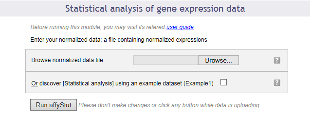

This dialog allows you to upload a tab-delimited text file with (cleaned) data. Alternatively, the module can be run with an example data set, by ticking the checkbox presented.
The interrogation mark button on all dialog forms will help you by giving you a contextual help.

Second step: describe the dataset
The following picture shows the screen obtained after completing the first step:

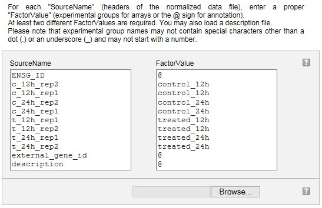

Your dataset has been read and the following information is presented in a two columns table:

Column "SourceName" is filled with the columns headers from your data file. These names will be used for the analyses.

Column "FactorValue" is to be completed. Add an at sign (@) for each columns that does not represent sample measurements (e.g. annotation columns), and add the appropriate desired experimental group name for each other column.

You may also prefer to enter directly this information from a file you have prepared. If this is the case, browse your description file in the second section. If you enter such a file the information contained in the previous table will be ignored.

Note that in case you reach the module directly from the AffyAnalysisQC module, you will find this table already filled with the array names and groups you entered in that module. You can modify the groups here if you wish.

Clicking on the "Next" button will direct to the last input form.
Third step: define your analysis
The input form is divided into three main sections: the first part allows a quick launch using direct group comparisons, the second part gives you a chance of defining advanced contrasts to be computed. The third part allows customisation of the required output options.

First part of the input form
The following image presents the first part; it recalls briefly what your dataset contains and asks you to enter an e-mail address. This is optional: if you don't enter your e-mail address, you will need to keep the browser opened and not close the page before the end of the calculation. On the contrary, if you enter your e-mail address - which is recommended - you can close the windows as soon as the next page appears and you will be informed of the completion of the analysis by e-mail. You will be presented with links to the result files in the e-mail.

You may launch the analysis with the "Run" button right after this first section. In this case pairwise statistical comparisons will be done between each of the groups of data by default (option available only in the case of 4 or less experimental groups).

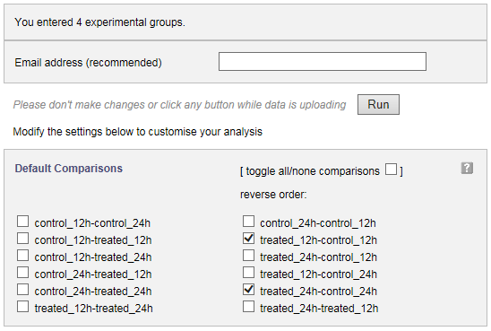

You can also choose the groups between which you require pairwise (e.g. experimental group - control group for each condition) statistical analysis to be done, by simply checking and unchecking boxes before you launch the analysis, as shown in the image above.

Second part of the input form
This part contains a text input box in which you can enter any custom contrast to be computed. When adding contrasts as well as predefined group comparisons (see above), both of them will be computed.

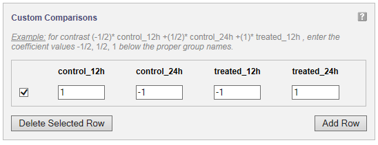

A statistical contrast can be any linear combination of the experimental groups. For instance, when for the example study presented in the image, you want to compute the difference over time for the treated samples, corrected for the difference over time for the control samples, you would compute (treated_24h - treated_12h) - (control_24h - control_12h). Simple arithmetic tells you this is control_12h - control_24h - treated_12h + treated_24h, which corresponds to the entries given in the figure. It is advisable to only use this option if you know about statistical contrasts or after consulting a statistician.

Third part of the input form
The following image presents the part of the input form concerning the plotting of the p-value and fold change histograms and computing the significant genes table. 

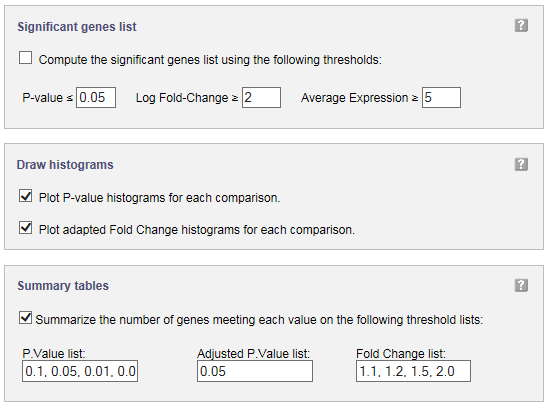

In significant genes list, you can define filters to select the genes to be added to a table of significantly changed genes and their statistical results. A table with p values and (log) fold changes for all genes is computed by default, and requires no ticking of a checkbox.
You can obtain histograms for the comparisons you have chosen to perform by ticking the checkboxes in the input form.
Significant genes summary tables can be obtained by entering a list of p value, adjusted p.value, and fold change cut-offs. For each of these cut-offs the number of genes meeting them will be computed and presented in a table.

Execution
After clicking 'Run' the module is executed.

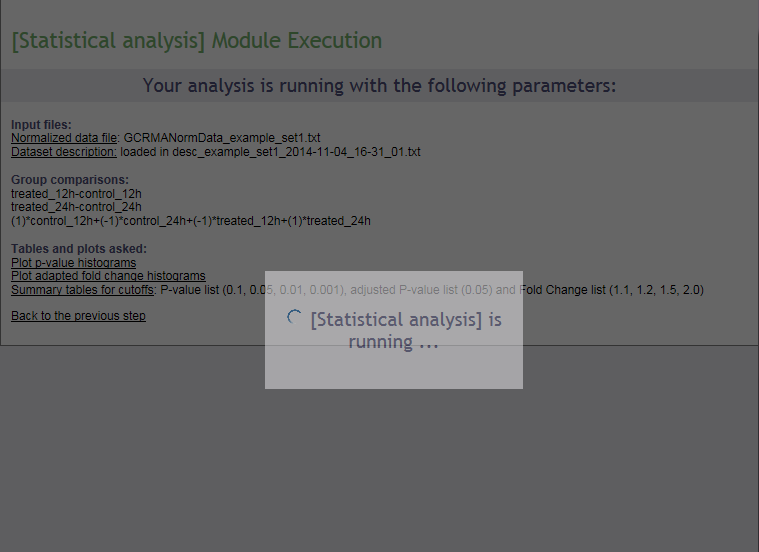 

Results
Upon completion a page of results is displayed on your screen.

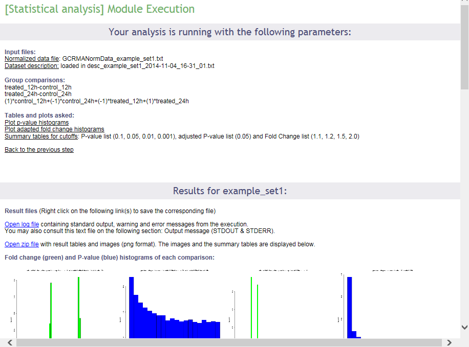

In the first part of the screen, your settings are recalled. Then links to the log file of the run and to the zip file containing all results (tables and images) are presented. Then, the p value and fold change histograms for each computed comparison are shown (clickable to enlarge, see below), if they have been chosen to be computed. These images are also part of the zip archive. The results will be described in the next section of this documentation.
Interpret the results of the Stat module
The p value histogram (see below) shows how often each interval of p values occurs. For random data, each p value is equally likely, and the histogram will be flat. For comparison of real different groups, the significant p values are expected to be overrepresented, and the histogram bars to be higher on the left side of the plot. For groups that are similar, non-significant p values are expected to be overrepresented, and the histogram bars to be higher on the right side of the plot.

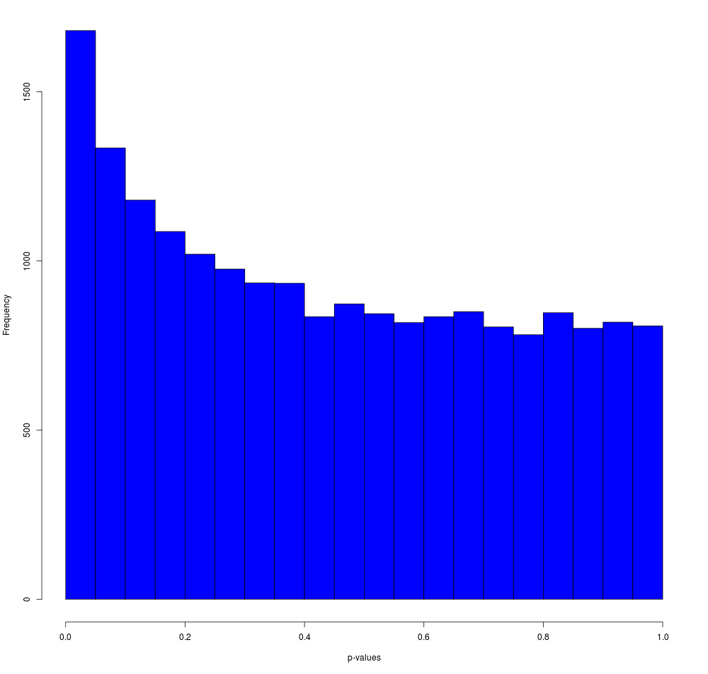

The fold change histogram (see below) shows how often each fold change occurs, and gives and idea about the number of up- and downregulated genes, as well as the size of the differences. This can also be relevant to determine cut-offs for further analysis procedures. Note that the fold change is an adapted fold change: upregulated values are kept as they are, but downregulated values are represented by the negative value of their upregulated counterpart. So, for example, a 2 fold downregulated gene, does not have the value 0.5 (ordinary ratio), but -2 (minus the equivalent upregulated ratio). 

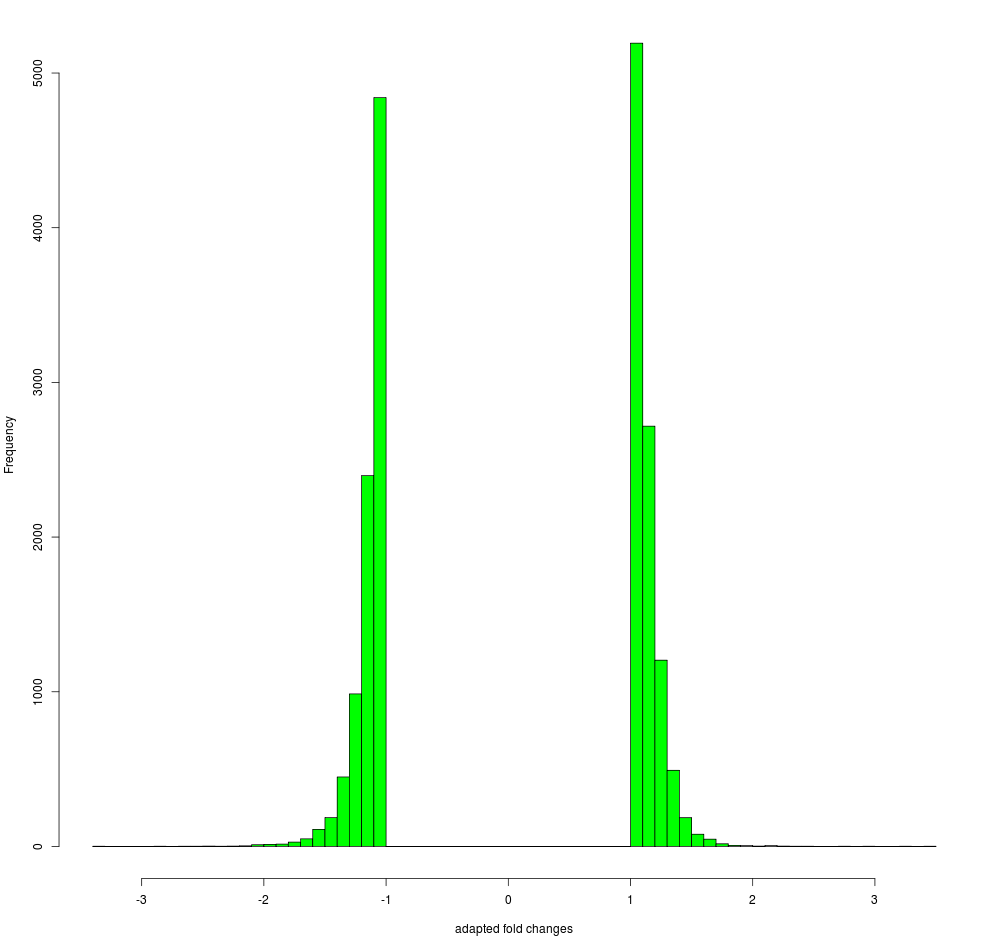

Furthermore, as shown below, the summary tables of p values and fold changes are shown, if they have been chosen to be computed. These tables, in a tab-delimited version, are also part of the zip archive. 

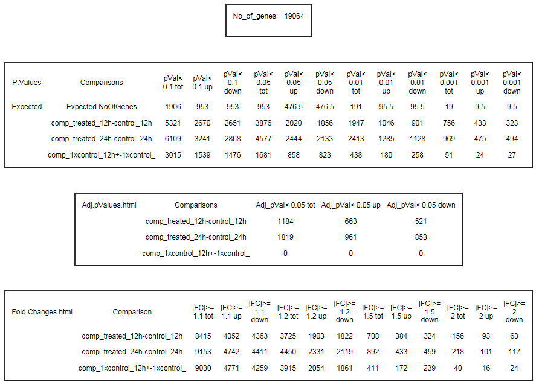

These tables indicate how many genes meet the chosen p value cut-offs and how many are expected to meet those purely by chance, how many genes meet the chosen adjusted p value cut-offs, and how many meet the chosen fold change cut-offs. The p value tables also indicate how many of the genes are up- and downregulated.

In addition, logging information is presented, as (partially) shown below. 

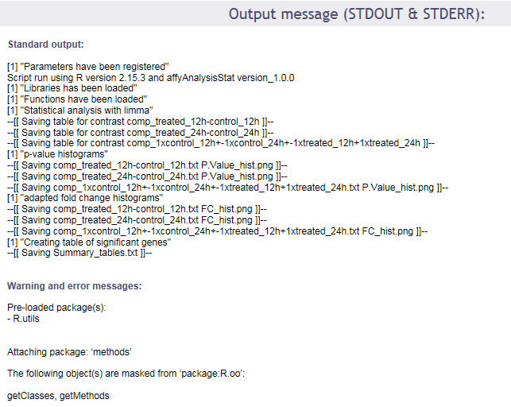

Finally, this documentation describes the format of the statistical tables that are available from the zip archive, and contain the p values and (log) fold changes for all genes. The figure belows shows a representative screenshot of an example table. 

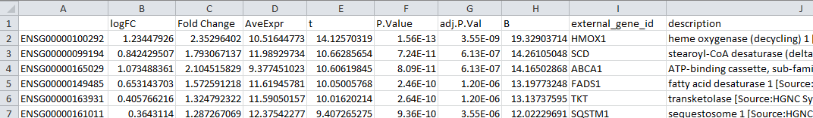

The table contains the following columns, as described below:
* identifier column - in the example containing Ensembl identifiers, but this depends on the data set that has been uploaded
* logFC - the log2 of the (regular) fold change, so the log2 of the ratio of the expression in both groups compared (or of the contrast outcome)
* Fold Change - an adapted version of the fold change, the ratio of the expression in both groups compared (or of the contrast outcome). For upregulated values the value is just the ordinary ratio; for negative values, the value is replaced by the negative of its upregulated counterpart
* AveExpr - the average expression over all samples in the experimental groups that have been compared
* t - the t-statistic of the limma adapted t-test
* P.Value - the p-value of the limma adapted t-test
* adj.P.Val - the Benjamini-Hochberg (FDR) corrected p-value
* B - the B-statistic
* external_gene_id - if available, an external name related to the identifier
description - if available, the description belonging to the external name related to the identifier
 

